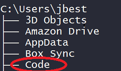
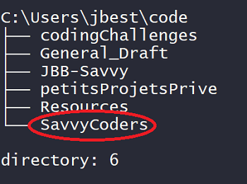

# Local Dev Environment and First Steps

Welcome to the first steps of your new coding life!

## Hardware Requirements

The equipment you'll need for this Bootcamp should meet the following requirements. (All specs below are minimum, more is better!)

- **OS:** Window 10 (preferred) or Windows 11 or MacOS
- **Processor:** Dual-core 2Ghz or higher (Intel i3/i5/i7 or AMD equivalent) or higher
- **Ram:** 8Gb minimum (Zoom requires 4Gb alone)
- **Disk space:** 256Gb
- **Monitors:** Dual monitors strongly suggested (1 laptop monitor and 1 external is acceptable)
- **A/V:** Camera, and Headphones with Microphone preferred
- **I/O:** External Keyboard and Mouse preferred

<br>

---

<br>

## Development Applications

To start training to become professional Data Analysts, we should start with the right tools for our **development environment**. These include the following:

1. A native client for Slack
2. A bash-friendly command-line interface like Git Bash
3. A version-control system like Git/GitHub
4. The Python language transpiler
5. A a Python dependency-manager like `pip`
6. And a code/text editor like the VS Code IDE

We'll show you how to setup all of these tools.

<br>

---

<br>

## Google Chrome Browser

If you have not  done so, install the [Google Chrome browser](https://www.google.com/chrome/).
We'll all use Chrome in class as the standard browser for uniformity, and because of the development tools that are part of Chrome.

<br>

---

<br>

## Building a Dev Environment

Whenever we work on a project, we want to make sure that we are using a consistent set of tools. Often web developers use tools that are modeled after the UNIX family of operating systems. These tools are usually packaged as a form of **terminal emulator**.

Let's install a (UNIX like) bash-friendly command-line interface or terminal, to help us interact with the computer.

Because each operating system is so different, we'll need to install a different set of tools for each -- to emulate the UNIX terminal through our command-line, and to use Python in our environments. \(More on "command-lines" and "terminals" in a minute\).

Scroll down to the correct section for your Operating System -- Linux, MacOS, or Windows.

<br>

---

<br>

### **Linux** -- For **Linux Users** Only

- Most Linux distributions ship with their own, fully-featured UNIX-based terminal emulators. Popular examples include GNOME Terminal, xterm, or Konsole \(depending on your desktop environment\).

- We also can take advantage of a cool framework that sits 'on top of' our Linux terminal, that can greatly enhance our terminal experience: ["Oh My ZSH"](https://ohmyz.sh/)

- If you're using a minimalist distribution like Arch, please use [kitty](https://sw.kovidgoyal.net/kitty/), installed through your distribution's package manager \(e.g. `pacman -S kitty` for Arch users\).

- To install `Git on Linux`, follow this link for detailed instructions: [https://git-scm.com/download/linux](https://git-scm.com/download/linux)

- To install `Python` on Linux, follow this link for detailed instruction: [Installing Python 3 on Linux](https://docs.python-guide.org/starting/install3/linux/)

- If `pip` was not installed along with `python`, follow this link for detailed instructions: [pip documentation v22.3.dev0](https://pip.pypa.io/en/latest/installation/#)

- Next, install the [VS Code](https://code.visualstudio.com/download) text editor, follow the link and choose the correct version to download.
  For detailed install instructions follow this link: [https://code.visualstudio.com/docs/setup/linux](https://code.visualstudio.com/docs/setup/linux).

<br>

---

<br>

### **macOS** -- For **Mac Users** Only

- FOR ANY OF THESE INSTALLS -- if the request is to SET the PATH variable, please DO SO.

- For Mac users, the Terminal application works well as a UNIX-compliant command-line.

- We also can take advantage of the zsh framework that sits 'on top of' the MacOS terminal to enhance the terminal experience: ["Oh My ZSH"](https://ohmyz.sh/)

- For more details on setting up your terminal, follow the directions in this link: [How to Configure Your Mac with Z Shell](https://www.freecodecamp.org/news/how-to-configure-your-macos-terminal-with-zsh-like-a-pro-c0ab3f3c1156/)

- For some versions of macOS, you will also need to consent to using XCode features. To trigger this installation/consent process, type in `git --version` and hit `ENTER`.
  If a version number is output to the screen, you're good to go.
  Otherwise, follow the prompts to make sure that you're set up with with XCode in your environment.

- Then, run the following commands in your terminal:
    1. `brew install git` -- To install Git versioning control
    2. `brew cask install visual-studio-code` -- To instal the VS Code code editor

- Install Python by downloading the latest version here: https://www.python.org/downloads/
  On the Splash Installation Screen, please check the "Set Path" option
  Further, use all of the standard settings.

- Usually, `pip` is automatically installed. You can check you version using this command in the Git Bash terminal command line:

  ```terminal
  python3 -m pip --version
  ```

- If `pip` is not installed, downloaded and install it using the following steps in the command line:

  **Step 1:** Download the  [get-pip.py](https://bootstrap.pypa.io/get-pip.py) file and store it in the same directory as python is installed. or Use the following command to download pip directly

    ```terminal
    curl https://bootstrap.pypa.io/get-pip.py -o get-pip.py
    ```

  **Step 2:** Now execute the downloaded file using the below command

  ```terminal
  python3 get-pip.py
  ```

  **Step 3:**  Wait through the installation process.

  **Step 4:** Verify if `pip` has been installed correctly by again performing a version check.

- Next install the [VS Code](https://code.visualstudio.com/download) text editor. Follow the link and choose the correct download. Use all of the standard settings. Once the download hasa completed, launch the installer and follow the prompts.

<br>

---

<br>

### **Windows** -- For **Windows Users** Only

- The windows command line is considered by some to be _wrong_ for web development. Luckily, the folks behind `git` have come up with a solution: `git-bash`, a UNIX-esque terminal emulator for Windows, packaged with `git`!

- To download both `git` and `git-bash`, head to [git-scm.com](https://git-scm.com/downloads), hit the "Downloads for Windows" button, and go through the prompts to complete the installation process.

- Once the installation process above is complete, use the Windows key to search for "Git Bash". Use this command-line for the duration of this course.

- Install Python by downloading the latest version here: https://www.python.org/downloads/.  
  On Splash Installation Screen, please check the "Set Path" option. Further, use all of the standard settings.
  Usually, `pip` is automatically installed. You can check you version using this command in the Git Bash command line:

    ```terminal
     `py -m pip --version`
    ```

- Next install the [VS Code](https://code.visualstudio.com/download) text editor. Follow the link and choose the correct download. Use all of the standard settings. Once the download hasa completed, launch the installer and follow the prompts.

<br>

---

<br>

### **All Together Now -- Everyone Do The Following System Checks:-**

Check that everything has been installed correctly by running the following commands in your terminal:

   1. `git --version`
     - you should see something like `git version 2.27.0` (the exact numbers may not match)

   2. `python --version`
     - you should see something like `Python 3.10.7` (the exact numbers may not match but you want to use at least version 3.10...)

   3. `pip --version`
    - you should see something like `pip 22.2.2 from C:\Python310\lib\site-packages\pip (python 3.10)`

   4. `code`
     - this should launch a new VS Code window

<br>

---

<br>

## Setting Up your GitHub SSH security Key

We will connect to GitHub on the web, by using the Secure Shell Protocol (SSH), which provides a secure channel over an unsecured network, to do uploads and downloads.

With SSH keys, you can connect to GitHub without supplying your username and personal access token at each visit. You can also use an SSH key to sign commits.

And, in your Git client, you can use the SSH based GitHub URL to clone your repos.

<br>

### **GitHub SSH key setup steps:**

1. Create a GitHub SSH key pair with the ssh-keygen command
2. Copy the value of the public SSH key to the clipboard
3. Login to GitHub and navigate to your account settings
4. Click on the SSH and GPG link
5. Click Add Key to register the public SSH key with your account
6. Name the key and paste the copied  value into the text field
7. Save your changes

<br>

> **For fully detailed steps (with images) and instructions on setting up an SSH key for GitHub see [Section00\0.1.1-GitHub_SSH_Key.md](0.1.1-GitHub_SSH_Key.md)**

<br>

---

<br>

## **`Visual Studio Code`** -- [code.visualstudio.com](https://code.visualstudio.com/)

The editor that we'll be using for this course is called `Visual Studio Code`, or `VS Code` for short \(_not_ Visual Studio, which is only available for Windows\).

It's a modular editor built for web development, maintained by Microsoft, and contributed to by a large Open Source community.

To open VS Code in the current directory/folder, use the command `code .`

<br>

> NOTE: If you're on macOS, install shell commands from the command pallette \(`CMD + SHIFT + P`\) by selecting the `Install 'code' command in PATH` option.


<br>

---

<br>

## **Developer Accounts**

There are a number of different online services that help us be productive. Here are three that we'll use for this class. (More on all these accounts to follow as we progress through the curriculum.)

**When setting these make sure to _associate these all with the same email account!_ you'll be using for everything during the Bootcamp!**

When signing up for these services, most of them will send email messages to confirm your new account. Some might require additional verification actions.

1. [Slack -- slack.com ](https://slack.com/)
2. [GitHub -- github.com ](https://github.com/)
3. [Jira from Atlassian Software](https://www.atlassian.com/software/jira)
4. [Install Insomnia API application](https://insomnia.rest/)

<br>

### **`Slack`** -- [slack.com](https://slack.com/)

All of our communication will go through the class-specific Slack channel! Please sign up for an account \(if you haven't already\) and download the slack client for your OS through your package manager.

<br>

### **`GitHub`** -- [github.com](https://github.com)

GitHub profiles are like a combination of LinkedIn and Facebook for developers, as well as a place to back up and store code.

- When you've created an account, post a link to your GitHub in the class Slack channel, and follow the profiles of your classmates and instructors!

- `Git` is a version control system that tracks changes to the files in our coding projects over time. The concept is that we take 'snapshots' of our project whenever we want to \(usually after completing a 'logical unit of work'\)

- Simply put, Git is a version control system that lets you manage and keep track of your source code history.

- `GitHub` is a cloud-based hosting service that lets you manage Git repositories. If you have open-source projects that use Git, then GitHub is designed to help you better manage them.

- Most Linux distributions come with `git` pre-installed, as does macOS.

- For Windows users, we already installed `git` as a part of downloading `git-bash` as your terminal emulator.

- Verify that you have `git` installed by typing `git --version` into your terminal. You should see some numbers \(e.g. `2.17.1`\).

<br>

### **`Jira from Atlassian`** -- [Jira](https://www.atlassian.com/software/jira)

We'll be using Jira, the popular industry software from Atlasian to run our Agile operations during this cohort.

- Your Agile coordinator will fill you in on all the detail, and send you an invite to join the correct team project etc.

<br>

### **`Install Insomnia API application`** -- [Insomnia.rest](https://insomnia.rest/download/)

Open the Insomnia link above, and select for you correct OS if you are not automatically directed to the correct install.

**Note:** Make sure to select the Insomnia FREE option if asked.

<br>

---

<br>

## **Interfacing with Computers**

- The `operating system` is the program \(series of instructions\) that runs when you turn on your computer.

- The `operating system` (OS) handles ...
    - `inputs` \(keyboard, mouse, camera, network connections\)
    - and `outputs` \(monitor, speakers, network connections\),
    - manages shared access to computing resources and memory,
    - and reads and writes data to the file system on behalf of
    - any number of simultaneously running applications \(web browser, code editor, terminal emulator, music player, etc\).

<br>

- We interact with the computer through the operating system, usually by TYPING, TOUCHING, or CLICKING.

- Computers can receive user input through either a `command line interface` \(CLI\) or a `graphical user interface` \(GUI\).

- In a `CLI` \(A.K.A. "Console", "Command Line", "Terminal", or "Shell"\), the user types commands using the `keyboard` to tell the computer to take an action. The computer will often display the results of the operation to the `console / screen`.

- All navigation on a computer could be done using words in the `terminal emulator`, instead of actions in the GUI.

- To be exact, the terminal or terminal emulator is just the `interface` for us to enter words into.

- The `Shell` \(e.g. 'bash' or 'zsh'\) is a program within the terminal that _executes_ some useful commands that we might type. Essentially, without the shell, our terminal would be unusable for all intents and purposes.

<br>

---

<br>

### **TERMINAL EXERCISE**

We will start out by using the CLI to navigate through the file system on our personal computers. The key is to think of the directory structure as a 'tree' with 'branches', a hierarchial interface we call a file structure.

1. Open up your terminal and type in `pwd`. What do you see?
1. Make a note of that folder's location, then repeat the process with your CLI
1. print your starting location: `pwd`
1. list the file structure: `ls`
1. change directories: `cd`
1. move up a directory: `cd ..`
1. move to your `$HOME` directory: `cd ~`
1. In your `$HOME` directory \(`~`\), create a folder called `Code` for all of your future coding projects. You can do that with the `mkdir` command \(e.g. `mkdir ~/Code`\)
  Once you are done, your folder structure should look something like this:

**For Windows Users...**



**For MacOS Users...**


<br>

9. Move into the new `Code` directory with the `cd` command \(e.g. `cd Code`\)

10. Inside of `Code`, create a `SavvyCoders` directory for all of your Savvy-related work. You can do that with the `mkdir` command \(e.g. `mkdir SavvyCoders`\).
  The result could look something like this:

**For Windows Users...**



<br>

---

<br>

## Summary

- At this point we should all have a working Development Environment setup.

- As we work with these tools over the next few weeks, all this will become second nature to you.

- Next week we'll start out working with Git and GitHub. Feel free to review what we've covered so far to prepare for that.

- If you wnt to get a head-start by reading up on Git and GitHub, here is and article about most of what we'll be covering: [https://www.freecodecamp.org/news/git-and-github-for-beginners/](https://www.freecodecamp.org/news/git-and-github-for-beginners/).

