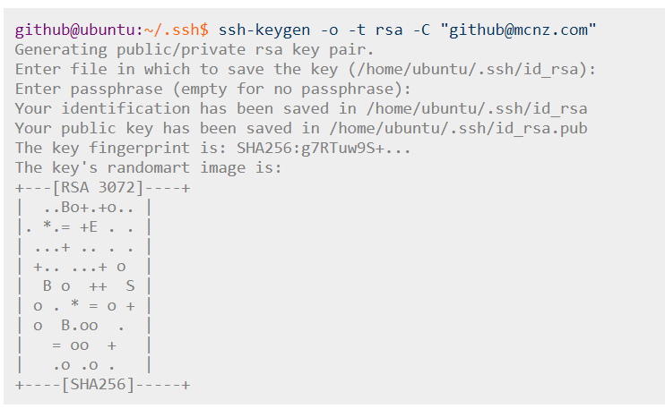
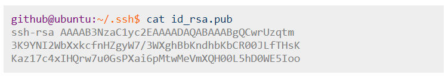
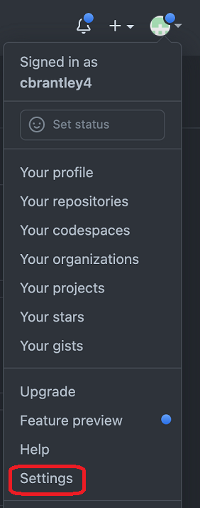
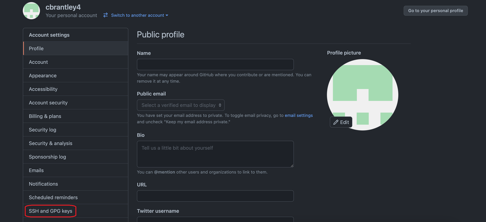
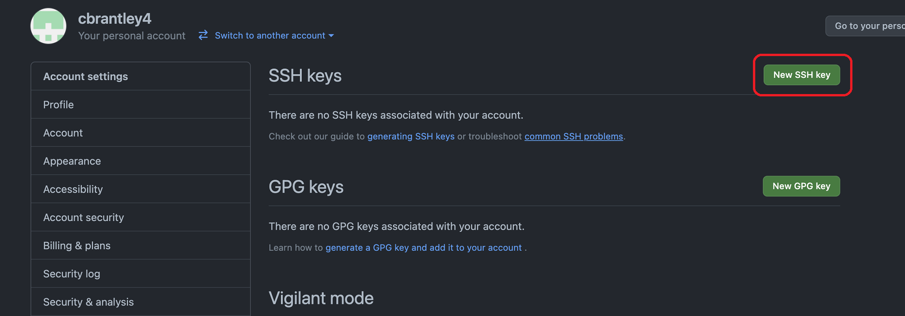
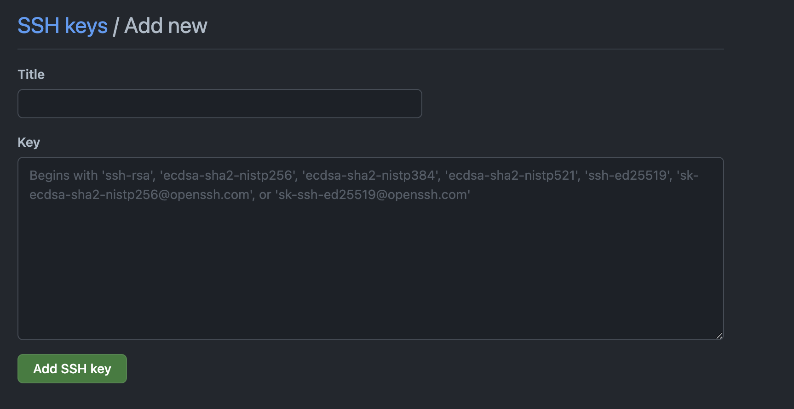

# Setting Up your Git and GitHub security:

## Generating a new SSH key

 

### 1.  Go to your home screen in your terminal. This should have the Tilde  `~` symbol.

  

 

### 2.  Type `ssh-keygen -t ed25519 -C "your_email@example.com"` into your terminal. Replace your_email@example.com with the email address that you used to create your GitHub account.

  

 

### 3.  A message will appear that says `Enter file in which to save the key`. **Just Press enter! DO NOT TYPE ANYTHING HERE!** A new file will be created by your computer.

  

 

### 4.  A message will appear that says `Enter passphrase`. **DO NOT ENTER A PASSWORD! Just Press enter WITHOUT typing a password.** This message will come up again for the password to be reentered. **Press enter again WITHOUT typing a password.**

  

  The output on your terminal screen should look something like this ...
  

 

### 5.  In your terminal type `ls -a`. This will display all of the folders on your computer. you should now see one called `.ssh`.

 

### 6.  Navigate into this folder by typing `cd .ssh`. You should not see this folder name beside the Tilde `~`.

  

 

### 7.  Type `ls` to list the contents of this folder. You will see at least two files. Both of these will start with ed25519 but one will be followed by `.pub`. These are the public and private keys that were created.

  

 

### 8.  Print the contents of the public key that you created by typing `cat id_ed25519.pub`. You will see the name of your key, the public key (a string of random numbers and letters), and your email address printed to the terminal. Copy the entire message.

The `cat` command should print out something like this...
 

 

### 9.  Go to [GitHub](https://github.com/) and click on the profile button in the top right of your screen. In the drop down menu that appears click on `Settings`.

  

 

### 10. On your profile settings page, select the `SSH and GPG keys` from the menu on the left hand side of your screen.

  

 

### 11. Click on the first green button on this page that says `New SSH key`.

  

 

### 12. You will be redirected to a page the asks for you to create the new key. For the title type in SavvyCoders. In the textbox for the key paste in the random string of numbers and letters that you copied in step 8.

  

 

### 13. You will now see that you have an SSH Key associated with your account. You are good to go!
