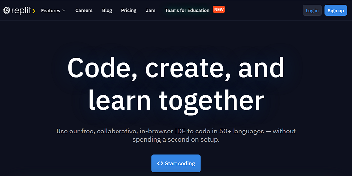
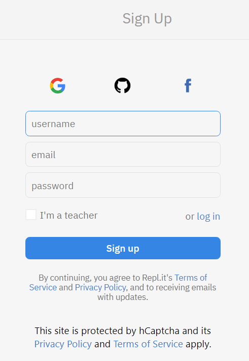
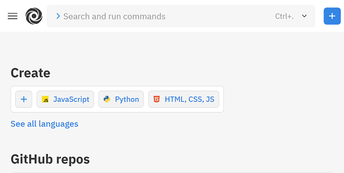
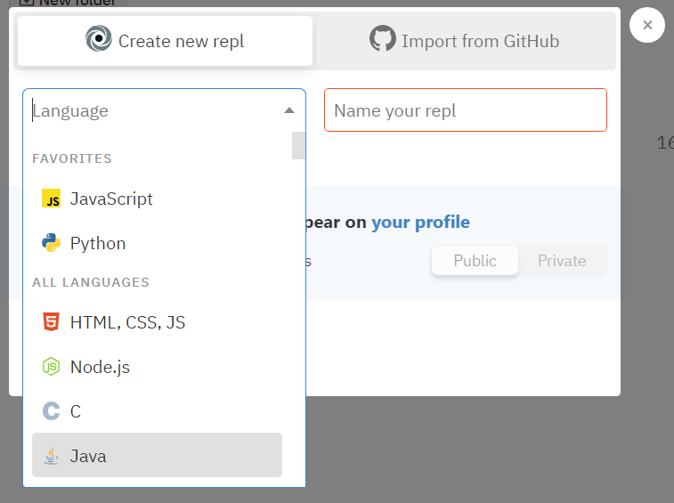
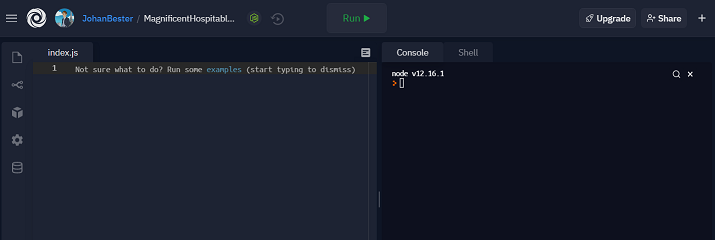

# Setting up a Replit Development Environment

## **1. Sign-up for [Replit](https://repl.it/) by clicking on this link.**

You should see a welcome screen much like this one.

- If you have already created an account login, else click the **`signup`** Button.

 

## **2. To Sign Up for a new account there are several options. You can sign up with your...**

- Google account
- GitHub account
- Facebook account
- Or with an email and password.

> Note: It's suggested that you use the *same email address* you used for *all* the other accounts you created for this Bootcamp.

Follow the setup dialog to fill out your profile, and select your coding languages.

You probably want to choose -- JavaScript, Node.js, HTML & CSS & JS

 

## **3. On the Replit home screen there are several ways to create a new Replit.**

On the left side menu bar there is a button to "Create Replit", and on the main page are there are several "Plus" buttons or the language buttons to click on.

 

## **4. A menu will pop up to choose a language if one has not been chosen, and the new Replit can be named here as well.**

 

## **5. The Replit work space has 2 panels -- the code space on the left, and the console/shell on the right.**

To run your code in the console, simply click the green run arrow.

 

> ### [Click here to learn more about the Repl.it IDE online.](https://repl.it/site/ide)

> ### [How to Use Replit – A Beginner's Guide from codecamp.com](https://www.freecodecamp.org/news/how-to-use-replit/)
