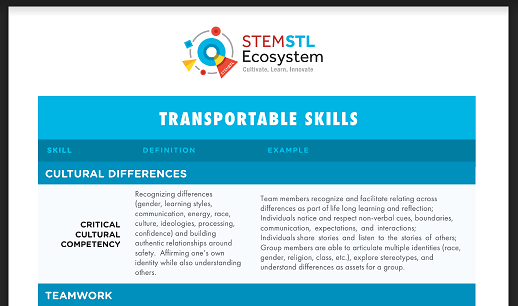

# Resumes, LinkedIn, Elevator Pitch

### **Objective: -**

Welcome to the Fullstack Bootcamp. In this Bootcamp you will learn way more than coding! We will teach you valuable skills that will set you up for the the rest of our career -- whatever that might be.

In this section we will learn about:

- Resumes
- Using LinkedIn
- Crafting an ELevator pitch, and an Intro speech

 

---

 

## **Resumes**

### A resume should contain a few main sections...

* name and contact detail
* Professional Summary
* Professional Achievements
* Employment History
* Education

**[Click here to see a PDF resume template](docs/Resume.Template.SavvyCoders.pdf)**

 

---

 

## **LinkedIn**

Not only is LinkedIn the place to create your online, professional brand, it is the portal to hiring managers and recruiters.

**[Read here "How to create a LinkedIn profile"](https://www.linkedin.com/help/linkedin/answer/2964/signing-up-to-join-linkedin?lang=en)**

### LinkedIn is valueble to ...
- Showcase your brand and portfolio!
- Use for researching companies you are interested in.
- Find jobs! -- Lots of jobs out there!
- Join Linkedin Groups.

**[Read this article on "How to market yourself with LinkedIn"](https://dev.to/the_jeff_white/how-to-market-yourself-36ie)**

### Here are two ready-made LinkedIn banners to highlight your involvement with the Savvy Coders Fullstack Bootcamp! ###

* [Savvy Coders dark themed banner](img/FS_LinkedInBanner_Dark.png)
* [Savvy Coders light blue banner](img/FS_LinkedInBanner_Light.png)

 

---

 

## **Speeches**

Everyday there are opportunities to market yourself and pitch your brand. You want to be ready to shine when those moments come!

The moment dictates what type of speech ew can deliver. Sometimes it's a quick Elevator pitch, an introductory speech, or a full presentation. By preparing in advance for every occasion, you'll always be ready to deliver!

 

### Elevator Pitch ###
- What is it?
- Who is the target audience?
- What is your "Unique Selling Proposition" or what makes you difference from the competition?
- Close with a strong "Call to Action"!

 

Your elevator pitch for mock interviews should be (approximately):

A sentence about self / background
How / why you chose Savvy
Why you chose this capstone / what problem it solves / how you built it

 

### Introductory Speech ###

The introduction speech is meant for Demo Day. It builds on the Elevator Pitch. The individuals that come to Demo Day want to hear a bit of a “story” about you, how you got to Demo Day, and about your capstone project!

- Explain "Why" you created this SPA
- What business problem is the SPA solving
- High Level Summary of the SPA functionality
- How is this SPA going to solve the stated problem

 

## Full Stack Web Development - Things to include in your presentation

- Have you used Agile/Jira for your project (organizing your team Jira boards in sprints, prioritizing backlog items, creating user stories and then how you did the same for your personal projects)

- What role did you play using SCRUM? (Product Owner, Scrum Master, Developer)

- What SCRUM ceremonies did you participate in and what was your role? (Daily standups, Sprint Planning/ Review)

- Being Agile certified

- Obstacles (talk about one and how you overcame it)

- Something you are really proud of accomplishing with your capstone (what was it and explain in detail the success)

- Technologies used: JavaScript, HTML, CSS, MongoDB, Node, Express, Netlify, Heroku, Forms, debugging your code, testing and any others used

- Wireframes/ User stories (show them) project planning, research that you did, how you defined your capstone as your project (SWOT)

- Researching APIs and how you implemented an API into your capstone (did you create an API or did you consume an API which is using existing data)

- Future state - what do want to add in the future or how you want to change

- Show your code!

### Watch this [video](https://www.youtube.com/watch?v=tXw8XeFmuuk&t=50s) to see how to incorporate these items into your presentation and get great ideas.

 

### Introductory speech Example: ###

 Hi! My name is Laurie Wilson.

 I have a background in IT Recruiting, Sales, and Leadership. I started my career in a technical capacity and was recruited for a new position. I decided that I liked the mix of technical and business, so IT recruiting and sales was natural to me.

 BUT, I have always been interested in coding. A co-worker who graduated from Savvy Coders had good things to say about the program, so I attended preview night and knew right away that the program was for me.

 I am a very health conscious individual, so for my capstone project, I decided to create a meal prep website that is meant for busy people who do not have a lot of time to devote to cooking. The website will allow users to indicate which type of nutritional needs fit their lifestyle and they can choose meal prep options accordingly.

 Many of the other meal prep websites I researched did not handle shopping lists very well, so I’ve included sections for dynamic lists that you can send to your iPhone or android for ease in the grocery store.

 I used technologies such as javascript, html5, css, etc……

 Now, let me show you what I’ve created!

  

## **What do employers want in an employee**

More specifically, "What do employers want, with regards to soft skills and culture fit, in an employee?"

Click this link to read all about the transportable "soft-skills" that employers are looking for in their employees today.

[STEMSTL Ecosystem Transportable Skills](https://drive.google.com/file/d/1NvNQhmcCbsAnB8ZxML61VYSiWEckJpyd/view)

You should see this PDF below open up...

