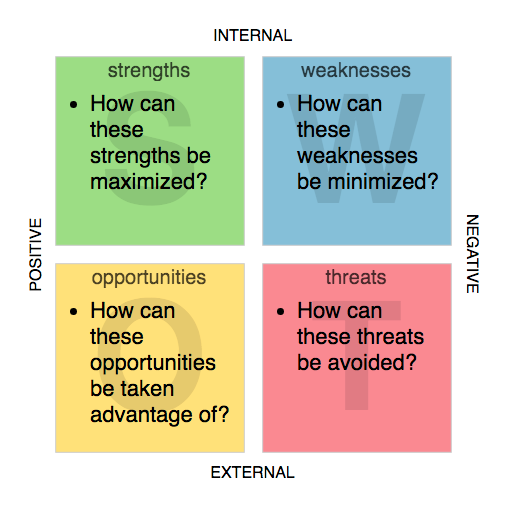

# SWOT Analysis - Project Planning

### **Objective: -**

The word S.W.O.T. is an acromym which stands for ...

- Strengths
- Weaknesses
- Opportunities
- Threats

A SWOT anaylsis, is a method to evaluate the viability of a project by looking at the above four areas.

SWOT is a simple but useful framework that helps you to build on what you do well, address what you're lacking, minimize risks, and take the greatest possible advantage of chances for success.

A SWOT analysis organizes your top strengths, weaknesses, opportunities, and threats into an organized list and is usually presented in a simple two-by-two grid.

Click this link to open a Google document template of the SWOT analysis.

[SWOT Analysis - Project Planning Template](https://docs.google.com/document/d/1AS_I6aDUy3FHavmheb-jS2qiLrm1xrmr6Q1uVHQKaGI/edit?usp=sharing)
