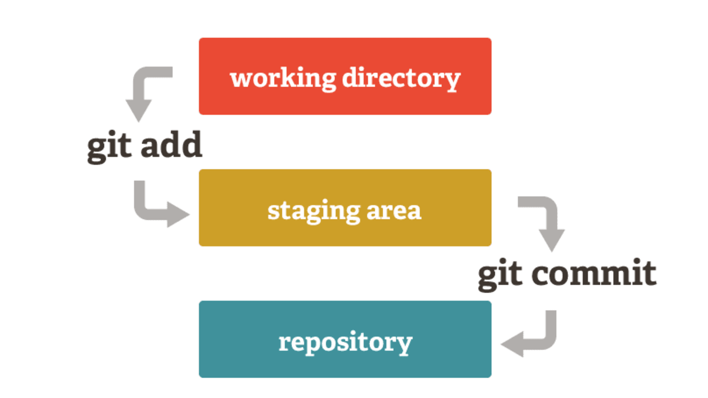
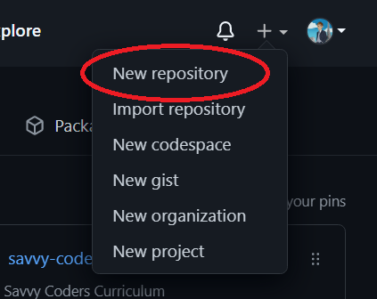
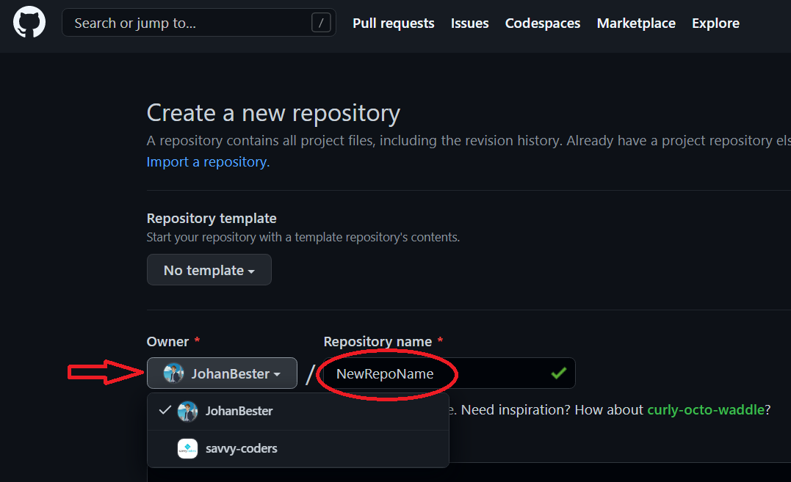
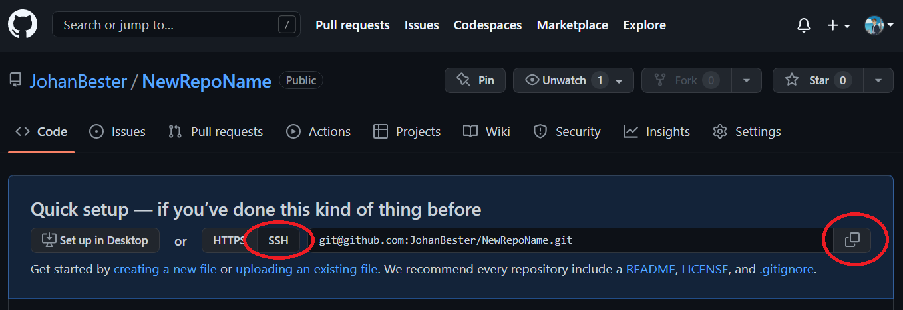
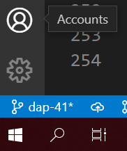
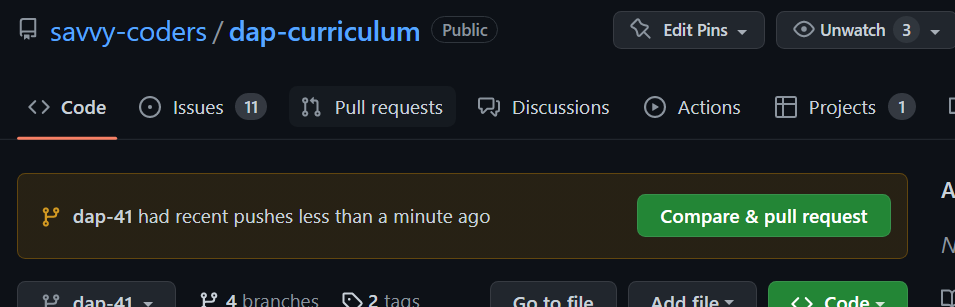

# Essential Tools for Development: CLI, Git and GitHub

## Welcome to the first class

<br>

### **Objective: -**

In this class we will will become familiar with of the most important and essential tools for development, the CLI, and Git/GitHub.

1. **The Command Line Interface (CLI) is the way a developer navigates through a computer's file structure.**

2. **[GIT](https://git-scm.com/doc) stands for "Global Information Tracker"**

   - Git is a mature, actively maintained open source project originally developed in 2005 by Linus Torvalds, the famous creator of the Linux operating system kernel.

3. **[GitHub](https://docs.github.com/en) is a cloud-based hosting service that lets you manage Git repositories.**

   - It is important to become comfortable with this because it enables you to manage and save your work in a way that would allow you to recover if something breaks or gets lost.
   - More specifically, we will look at:
      - Git cloning
      - Git branching
      - Git forking

<br >

---

<br >

## **The Command Line Interface (CLI)**

<br>

Computers can receive user input through either a **Command Line Interface (CLI)** or a graphical user interface (GUI). In a command line interface (A.K.A. "Console", "Command Line", "Terminal", or "Shell"), the user types commands using the keyboard to tell the computer to take an action.
The computer will display the results of the operation by writing text to the screen.

**NOTE**: From here on out, we'll use the terms `terminal`, `command-line`, and `CLI` interchangeably.

<br>

### **Some Basic Terminal Commands**

- `pwd` - **P**rint **W**orking **D**irectory
- `cd` - **C**hange **D**irectory
  - `cd ~` - Move to home directory (same as just `cd`)
  - `cd ..` - Move _up_ one directory
  - `cd folderName` - Move _down into_ folder
- `ls` - List files in current/working directory
  - `ls -a` - list _all_ files (including hidden files); the `-a` is a **_flag_** that indicates the specific way we want to run the command
- `mkdir folderName` - **M**a**k**e **Dir**ectory (Create _Folder_)
- `touch fileName` - Create new _File_

<br >

> **TIP**: Take advantage of 'auto-completion.' Type the first few characters of a file or directory name then press 'Tab.' The _command prompt_ will try to complete the name or give you a list of possible choices.</span>

<br >

> **TIP**: Press 'Up Arrow' to bring up previously typed commands.</span>

<br>

---

<br>

#### **Quick CLI Activity**

#### Use basic shell commands to set up your Savvy Coders directory

We will start out by using the CLI to navigate through the file system on our personal computers. The key is to think of the directory structure as a 'tree' with 'branches'.

1. Open the Git Bash CLI terminal on your computer.
1. Verify that you are in your `$HOME` directory. You should see a "`~`" in your command prompt somewhere. If you don't see that, type "`cd ~`" and press 'Enter' to make sure that you are `$HOME`. You should see something like this...

   ```shell
      MINGW64 ~
   ```

1. Print your starting location: `pwd`
1. _List_ the folder contents: `ls`
1. In your `$HOME` directory (`~`), _create a folder_ called `Code` for all of your future coding projects: `mkdir Code`
1. _List_ the folder contents again (`ls`). Do you see your new folder?
1. _Move_ into your Code directory: `cd Code`
1. Inside of `Code`, _create a `SavvyCoders` directory_ for all of your Savvy-related work: `mkdir SavvyCoders`
1. _Move_ to your `$HOME` directory: `cd`
1. _Move_ back into your `SavvyCoders` directory: `cd Code/SavvyCoders`

The result of this activity should produce a directory structure that looks more-or-less something like this...

**For Windows Users...**


**For MacOS Users...**


<br>

### **We'll revisit the CLI next week to learn and practice more.**

<br >

---

<br >

## **Git-Flow with git and GitHub**

<br>

### Version Control with `git`

To help us maintain, back up, and share our codebases, we're going to use `git` (the command-line tool) and GitHub (the online repository). These tools are fundamental parts of the web developer's workflow, and you'll be using them _every day_ for the rest of your programming career!

`git` works a bit like a Time Machine, in the sense that you'll be able to revert to any saved state within a directory. So if you mangle your site's directory structure, you can always use `git` to revert back to simpler times. The important things to understand about `git` specifically:

1. This is a CLI utility, so get ready for lots of text. All of our important files when programming will be text, so its only natural that we'd be navigating between save states (called 'commits') using text as well.
1. **Arbitrarily or automatically saving code is NOT a feature of git, and it shouldn't be**. You only want to save meaningful chunks of code (e.g. a feature), not broken pieces here and there. Otherwise, there's no way to revert back to a useful save-state!
1. Because of point #2, 'saving' your progress with git is handled a bit differently. You are in charge of 'staging' your commits, and 'committing' changes only when you are ready.



<br >

### **Some Basic `git` Commands**

<br>

These commands are executed in the CLI.
We installed `git` into our terminal emulator. That's why each of these commands starts with "git" - we need to let our terminal emulator know that we want to access a specific program (`git`)

- `git status` - Display status of current repo, including files ready to commit, modified files, and untracked files.
- `git diff fileName` - Display a file's _changes_ from previous commit
- `git add fileName` - Add file to 'staging' area

  - `git add .` - Add all untracked and modified files to 'staging' area

    > **NOTE**: Use the `"git add ."` command carefully. This command could add generated files, backups, and config files with stuff you don't want added.
    > There's nothing wrong with using `"git add ."` if your `.gitignore` file is up to date, and you are sure it won't add anything that you don't intend to track.
    > Always do a `git status` first to check what might get added.
    > In general it's better to use (small) specific wild cards like `"git add *.png"`, or simply add file by file.

- `git commit -m "Your Message Here"` - Save a 'snapshot' of your repo with message describing changes

- `git commit -am "message"` - You don't need to use `"git add"` every time you commit, this command will add to the commit _everything that has been modified_ since the last commit.

  > **NOTE**: Commit messages are typically written as a direct command/request, not descriptions of the work done.

  > > **GOOD**: "Add navigation menu", "Fix bug in log-in form"

  > > **BAD** "Added navigation menu", "Fixes bug in log-in form"

- `git push` - Add (push) local repo's committed changes to _GitHub_ repo
- `git pull` - Add (pull) changes from GitHub repo to _local_ repo
- `git log` - Log of all commits for the repo
- `git init` - Initialize a git repo in an existing folder

<br >

---

<br >

### **git Activity 1**

<br>

#### Configure user identity in git

<br>

1. Open the Git bash terminal on your computer.
2. In any command prompt, type the following (using your name and email, of course):

```shell
 git config --global user.name "FirstName LastName"
 git config --global user.email "your.email@example.com"
```

3. You can check all of your configuration settings by typing: `git config --list`
   - > to get out of the `config` function press the `"q"` key once

<br >

---

<br >

### **git Activity 2**

<br>

#### **Let's create a 'throwaway' repo to practice basic git commands**

<br>

1. From CLI, navigate to `Savvycoders` directory we created earlier, and use the `mkdir` command to _create a new folder_ called `ThrowawayRepo`: `mkdir ThrowawayRepo`
1. _Move_ into `ThrowawayRepo` with the cd command: `cd ThrowawayRepo`
1. **Init**ialize a git repository inside this directory: `git init`
   - If successful, `(master)` should be displayed after the directory name in the terminal
   - `git init` adds a directory named ".git" to the folder
1. _List_ (`ls`) the contents of `ThrowawayRepo`. Do you see the `.git` folder? Why not?
   - Try `ls -a`. Do you see `.git` now? Why?
1. You should recognize when you have a repository open in your Git Bash terminal. You should be seeing the word  `(master)` or `(main)` following the name of your folder name in the command prompt.
1. _Create_ a new text file in your Repo: `touch fileName.txt`
1. View the status of your repo: `git status`
   - What does the information show?
1. Add the untracked file to the local repo: `git add fileName.txt`
1. View the status of your repo again. What changed?
1. 'Save' a snapshot of the current state of your repo: `git commit -m "Add initial file"`
1. View the status of your repo once again. What does the CLI show?
1. Display the commit history for your repo: `git log`
   - Do you see your commit?
1. Let us delete the local copy of the repo on our local machine.
   - To Delete, use these commands:
      - To delet a File -- `rm file.txt`
      - To delete a Directory -- `rm -r Directory_Name`
   - The -`r` parameter means recursively. Recursion is necessary for Bash to repeat the command through a list of all files and sub-directory within the parent directory.
   - So to remove the `ThrowawayRepo`, use ... `rm -r ThrowawayRepo`

<br>

---

<br>

> NOTE:- There are many techniques and different ways of working with Git and Git Repos.
> For now, we are only teaching you the basics of what is needed for your to get a good start.
> There will be time for you to learn much more and much deeper as you move forward in your Data Analytics career.

<br >

---

<br >

### **git Activity 3**

<br>

#### **Creating and "Cloning down" a Git Repo to your local machine**

<br>

1. Navigate to your profile on GitHub: <https://github.com/>, and make sure you are logged in.
1. In the top right corner of the GitHub app, clicking on the plus-sign (`"+"`) will open a menu with options to create different elements.
1. Click the option to create a `"New repository"`

      <br>

      

      <br>

1. On the "Create a new repository" page, select the "Owner" of this new repo if it is not already selected, and type a name for your new repository.

      <br>

      

      <br>

1. Leave your repo public, ignore the other options on the page for now, and click on the green "create repository" button.
1. You will be directed to the new repo on your profile, in GitHub.
1. **We are going to copy the repo url, and use it to clone this new repo down to our local machine.**
1. Make sure to select the `"SSH"` option, and then click the copy button to the far right of the repo URL. **NOTE**: It's necessary to use the 'SSH' method to clone, rather than the default 'HTTP': This is why we setup out SSH-Keys.

      <br>

      

      <br>

1. In your terminal, navigate to the `SavvyCoders` folder, and _clone_ your new repo:-
   `git clone {YourGitHubURLlinkGoesHere} {new local name for this repo}`
   EG:- `"git clone git@github.com:JohanBester/PY4E_Coursera.git PythonRepo"`
   > `{new local name for this repo}` is an optional argument that renames (or aliases) the directory/repo on your  local computer. Without it, the folder is named after your GitHub repo name

   <br>

1. _Navigate_ into your new repo / directory. The word `(master)` or `(main)` should be displayed after the directory name in the terminal.

1. We can launch VSCode form anywhere in the CLI. To open VS Code in this current directory where we are, use this command in the terminal: "`code .`"
1. When you open VS Code, you might notice, in the bottom right corner, a message prompting you to install extensions. Click "Install"
1. In the bottom left corner of the VS Code UI, you can see which branch of your repository you are on right now (This name should be the the same as the name in parenthesis in your Bash terminal).

      <br>

      

<br>

---

<br>

### **Cloning any GitHub Repo**

<br>

**One can normally clone just about any repo from GitHub.**

When you clone a repository, you copy the repository from GitHub.com to your local machine.

Cloning a repository pulls down a full copy of all the repository data that GitHub.com has at that point in time, including all versions of every file and folder for that project.

If you would like to make changes directly to a repository, and you have the permission to contribute to that project, then cloning will be the first step before you can implement any actual changes and push to that project.

<br>

#### **Steps to clone any Repo from GitHub:-**

1. On GitHub, navigate to the repo you would like to clone.
1. Clicking the big green "Code" button opens a drop-down menu with options for cloning the repo.

      <br>

      

      <br>

1. Follow the steps to copy the repo URL to your clipboard like we did before.
1. In your terminal, navigate to the location where you want to 'clone down' this repo.
1. Use the `git clone {paste repo URL} {optional new name}` command to clone the repo.

<br>

---

<br>

### **Creating and Managing Branches on GitHub**

<br>

As we mentioned, you should recognize when you have a repository open in your Git Bash terminal. You should be seeing `(master)` or `(main)` following the folder name in the command prompt.
   > GitHub is currently working on changing `(master)` to `(main)`; Both of these refer to the same branch.

This name in the parenthesis not only tells you that you have an open repository, but also on which branch of a repo you are working.

Your **Master Branch** can be thought of as your main working area.

You can create / cut a branch from this main working area that exactly copies the main branch, allowing you to make changes to the code base without endangering your original code in the master branch.

When working in a team, co-coding a project, it is standard procedure to ...

- cut a branch from the main code-base
- develop the code for that new feature
- test and review the new feature
- and then finally merge the new feature into the main code-base

The changes you make in your sub-branch are isolated to that branch only, until the sub-branch is merged back into the master/main branch.

Look at the following graphic to help with this topic.

<br>


<br>

**To create a new branch in your terminal, in the folder containing your repo, type the command `git checkout -b <nameOfBranch>`.**

Once this new branch is created, you should see the new branch name inside parenthesis after the folder name.

To take the work you have completed on the branch and merge it into master, first go through the 3 steps of the '`git add`', '`git commit -m "..."`', and '`git push`' process.

When this is complete go to your GitHub account and select '`pull request`' from the tabs across the top.

Create a new pull request to merge your branch back into the master/main branch.

<br>



<br>

---

<br>

### **Creating a Fork on GitHub**

<br>

The idea for creating a fork of a repository is similar to creating a clone or a branch. In each case you are creating an exact copy of the upstream repository.

The difference lies in the intended use for the copy.

When you fork a repo, the intention is to have a starting point for your own project. The updates made in your fork of the repo are on your computer and are independent of the upstream repo. **In other words, a fork has no link to the original repo it was forked from.**

If you would like to fork a repo, simply go to that repository on GitHub.
On the upper right you will find a button that says `Fork`. Click it then create your own name, and copy the fork down to your local machine as before.

<br>

---

<br>

> ### For Further Git and GitHub Study - required viewing
>
> [Git and GitHub for Beginners - Crash Course (YouTube video 1 hour - Freecodecamp.org)](https://youtu.be/RGOj5yH7evk)

<br >

In the "Addendum of Resources" there are some additional links to Git / GitHub resources.

[Git and GitHub Resources](../../dap-curriculum/AddendumOfResources/AddendumOfResources.md#git-and-github-resources)

---

<br >

#### **git Activity 4 (Students)**

#### Repeat the steps above on your own to create 3 different Repos on your local machine inside your `~/code/savvycoder/` folder:-

- Activities
- Homework
- Capstone

<br >

---

<br >

### **Summary: -**

Congrats! You now know the basics of CLI, git, and GitHub.

You learned about ...

- The command line
- Git and GitHub
- Creating repos
- Cloning repos
- Git branching
- Forking repos

We will continue working on these skills a we progress through the BootCamp.

> Remember to work at using YOUR KEYBOARD TO TYPE COMMANDS AND TO NAVIGATE!
