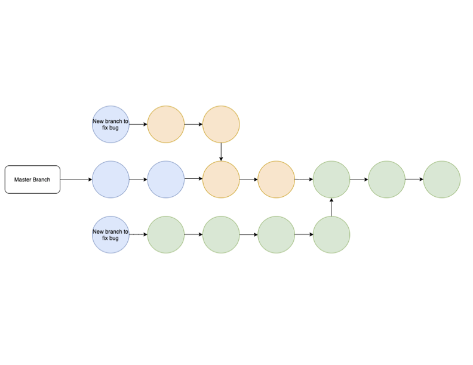

# Essential Tools for Development: CLI, Git and GitHub

## Welcome to the first class!

<br>

### **Objective: -**

In this class we will will become familiar with of the most important and essential tools for development, the CLI, and Git/GitHub.

<br>

**The Command Line Interface (CLI) is the way a developer navigates through a computer's file structure.**

<br>

**[GIT](https://git-scm.com/doc) stands for "Global Information Tracker"**

Git is a mature, actively maintained open source project originally developed in 2005 by Linus Torvalds, the famous creator of the Linux operating system kernel.

<br>

**[GitHub](https://docs.github.com/en) is a cloud-based hosting service that lets you manage Git repositories.**

It is important to become comfortable with this because it enables you to manage and save your work in a way that would allow you to recover if something breaks or gets lost.

<br >

---

<br >

## CLI

Computers can receive user input through either a **Command Line Interface (CLI)** or a graphical user interface (GUI). In a command line interface (A.K.A. "Console", "Command Line", "Terminal", or "Shell"), the user types commands using the keyboard to tell the computer to take an action.
The computer will display the results of the operation by writing text to the screen.

**NOTE**: From here on out, we'll use the terms `terminal`, `command-line`, and `CLI` interchangeably.

### **Some Basic Terminal Commands**

- `pwd` - **P**rint **W**orking **D**irectory
- `cd` - **C**hange **D**irectory
  - `cd ~` - Move to home directory (same as just `cd`)
  - `cd ..` - Move _up_ one directory
  - `cd folderName` - Move _down into_ folder
- `ls` - List files in current/working directory
  - `ls -a` - list _all_ files (including hidden files); the `-a` is a **_flag_** that indicates the specific way we want to run the command
- `mkdir folderName` - **M**a**k**e **Dir**ectory (Create _Folder_)
- `touch fileName` - Create new _File_

<br >

> **TIP**: Take advantage of 'auto-completion.' Type the first few characters of a file or directory name then press 'Tab.' The _command prompt_ will try to complete the name or give you a list of possible choices.</span>

<br >

> **TIP**: Press 'Up Arrow' to bring up previously typed commands.</span>

<br>

---

<br>

#### **Quick CLI Activity (Everyone)**

#### Use basic shell commands to set up your Savvy Coders directory

We will start out by using the CLI to navigate through the file system on our personal computers. The key is to think of the directory structure as a 'tree' with 'branches'.

1. Open the Git Bash CLI terminal on your computer.
1. Verify that you are in your `$HOME` directory. You should see a "`~`" in your command prompt somewhere. If you don't see that, type "`cd ~`" and press 'Enter' to make sure that you are `$HOME`. You should see something like this...
   ```shell
      MINGW64 ~
   ```
1. Print your starting location: `pwd`
1. _List_ the folder contents: `ls`
1. In your `$HOME` directory (`~`), _create a folder_ called `Code` for all of your future coding projects: `mkdir Code`
1. _List_ the folder contents again (`ls`). Do you see your new folder?
1. _Move_ into your Code directory: `cd Code`
1. Inside of `Code`, _create a `SavvyCoders` directory_ for all of your Savvy-related work: `mkdir SavvyCoders`
1. _Move_ to your `$HOME` directory: `cd`
1. _Move_ back into your `SavvyCoders` directory: `cd Code/SavvyCoders`

The result of this activity should produce a directory structure that looks more-or-less something like this...

**For Windows Users...**


**For MacOS Users...**


<br>

### **We'll revisit the CLI next week to learn and practice more.**

<br >

---

<br >

## git and GitHub

### Version Control with `git`

To help us maintain, back up, and share our codebases, we're going to use `git` (the command-line tool) and GitHub (the online repository). These tools are fundamental parts of the web developer's workflow, and you'll be using them _every day_ for the rest of your programming career!

`git` works a bit like a Time Machine, in the sense that you'll be able to revert to any saved state within a directory. So if you mangle your site's directory structure, you can always use `git` to revert back to simpler times. The important things to understand about `git` specifically:

1. This is a CLI utility, so get ready for lots of text. All of our important files when programming will be text, so its only natural that we'd be navigating between save states (called 'commits') using text as well.
1. **Arbitrarily or automatically saving code is NOT a feature of git, and it shouldn't be**. You only want to save meaningful chunks of code (e.g. a feature), not broken pieces here and there. Otherwise, there's no way to revert back to a useful save-state!
1. Because of point #2, 'saving' your progress with git is handled a bit differently. You are in charge of 'staging' your commits, and 'committing' changes only when you are ready.


<br >

### **Some Basic `git` Commands**

<br>

These commands are executed in the CLI.
We installed `git` into our terminal emulator. That's why each of these commands starts with "git" - we need to let our terminal emulator know that we want to access a specific program (`git`)

- `git status` - Display status of current repo, including files ready to commit, modified files, and untracked files.
- `git diff fileName` - Display a file's _changes_ from previous commit
- `git add fileName` - Add file to 'staging' area

  - `git add .` - Add all untracked and modified files to 'staging' area

    > **NOTE**: Use the `"git add ."` command carefully. This command could add generated files, backups, and config files with stuff you don't want added.
    > There's nothing wrong with using `"git add ."` if your `.gitignore` file is up to date, and you are sure it won't add anything that you don't intend to track.
    > Always do a `git status` first to check what might get added.
    > In general it's better to use (small) specific wild cards like `"git add *.png"`, or simply add file by file.

- `git commit -m "Your Message Here"` - Save a 'snapshot' of your repo with message describing changes

- `git commit -am "message"` - You don't need to use `"git add"` every time you commit, this command will add to the commit _everything that has been modified_ since the last commit.

  > **NOTE**: Commit messages are typically written as a direct command/request, not descriptions of the work done.

  > > **GOOD**: "Add navigation menu", "Fix bug in log-in form"

  > > **BAD** "Added navigation menu", "Fixes bug in log-in form"

- `git push` - Add (push) local repo's committed changes to _GitHub_ repo
- `git pull` - Add (pull) changes from GitHub repo to _local_ repo
- `git log` - Log of all commits for the repo
- `git init` - Initialize a git repo in an existing folder

<br >

---

<br >

#### **git Activity 1 (Everyone)**

#### Configure user identity in git

1. Open the Git bash terminal on your computer.
2. In any command prompt, type the following (using your name and email, of course):

```shell
$ git config --global user.name "FirstName LastName"
$ git config --global user.email "your.email@example.com"
```

> **NOTE**: The "\$" indicates a prompt from the CLI. It is not meant to be typed. </span>

3. You can check all of your configuration settings by typing: `git config --list`

<br >

---

<br >

#### **git Activity 2 (Everyone)**

#### Let's create a 'throwaway' repo to practice basic git commands

1. From CLI, navigate to `Savvycoders` directory we created earlier, and use the `mkdir` command to _create a new folder_ called `ThrowawayRepo`: `mkdir ThrowawayRepo`
1. _Move_ into `ThrowawayRepo` with the cd command: `cd ThrowawayRepo`
1. **Init**ialize a git repository inside this directory: `git init`
   - If successful, `(master)` should be displayed after the directory name in the terminal
   - `git init` adds a directory named ".git" to the folder
1. _List_ (`ls`) the contents of `ThrowawayRepo`. Do you see the `.git` folder? Why not?
   - Try `ls -a`. Do you see `.git` now? Why?
1. _Create_ a new text file: `touch fileName.txt`
1. View the status of your repo: `git status`
   - What does the information show?
1. Add the untracked file to the local repo: `git add fileName.txt`
1. View the status of your repo again. What changed?
1. 'Save' a snapshot of the current state of your repo: `git commit -m "Add initial file"`
1. View the status of your repo once again. What does the CLI show?
1. Display the commit history for your repo: `git log`
   - Do you see your commit?
1. In your browser, log into GitHub and create a new repository using the "+" menu in the top right corner. Name your repo anything you like, this repo will be temporary.
   - **DO NOT** check the box to initialize the repo with a README
1. We need to link our local repo to our GitHub repo. On your GitHub repo page, copy the repo's URL from the top box using the clipboard button on the right.
1. In the terminal, point your local repo to your GitHub repo: `git remote add origin YourGitHubLinkGoesHere`
   > **TIP**: Use "Shift + Insert" to paste into the terminal
1. Add changes from your local repo to your GitHub repo: `git push -u origin master`
   - The `-u` flag sets the GitHub repo as the '**u**pstream' branch
1. In your browser, refresh your GitHub repo page. You should see your text file.
1. Click the green button to add a README. Add some text to the file and commit the file with the green button at the bottom of the page. You now have two files in your GitHub repo.
   - In your terminal, _list_ the files in `ThrowawayRepo`. Can you see `README.md`?
1. In your terminal, add (pull) files/changes from your GitHub repo to your local repo: `git pull`
1. In your terminal, _list_ the files in `ThrowawayRepo`. Now can you see `README.md`?
1. Delete your GitHub repo by clicking "Settings", then scrolling down the bottom of the page. Inside the box with a red border, click "Delete this Repository"
   - For safety, GitHub requires you to enter the repo name and your password before deleting a repo.
1. After deleting the repo on GitHub, let's delete the local copy of the repo on our local machine.
   - To Delete, use these commands:
      - To delet a File -- rm file.txt
      - To delete a Directory -- rm -r Directory_Name (the -r parameter means recursively.)
   - Recursion is necessary for Bash to repeat the command through a list of all files and sub-directory within the parent directory.
   - So to remove the `ThrowawayRepo`, use ... `rm -r ThrowawayRepo`

<br >

---

<br >

#### **git Activity 3 (Everyone)**

> #### **Use Savvy Coders template repo**

Setting up and configuring the necessary tooling is a worthwhile exercise in and of itself, but can be a bit tedious. So, for the time being, we are going to reap the benefits of using a [repository template](https://github.com/savvy-coders/savvy-starter) that includes all of the linting and VS Code extensions and settings that we should need to get started. As you gain experience, you may choose to further customize these settings to suit your specific purposes.

1. Visit the template repo on GitHub: https://github.com/savvy-coders/savvy-starter
1. Click the green "Use this template" button, name your repo, and create it
1. Notice under the repo name it says "generated from [savvy-coders/savvy-starter](https://github.com/savvy-coders/savvy-starter)"
1. Copy a link to the repo by clicking the green "Clone or download" button and then clicking the clipboard
1. In your terminal, navigate to `SavvyCoders` and _clone_ the repo: `git clone YourGitHubLinkGoesHere Firstname_Lastname`
  > **NOTE**: It will be necessary to use the SSH method to clone, rather than the default HTTP:
  
   - `Firstname_Lastname` is an optional argument that renames (or aliases) the directory/repo on your computer
   - Without it, the folder is named after your GitHub repo name
1. _Move_ into your "Name"/`Firstname_Lastname` directory, `(master)` should be displayed after the directory name in the terminal
1. We can launch VSCode form anywhere in the CLI. To open VS Code in the current directory where we are, use this command in the terminal: `code .`
1. When you open VS Code, in the bottom right corner, it should prompt you to install extensions. Click "Install"

<br>

### **Creating a Branch on GitHub**

<br>

You should recognize when you have a repository open in your Git Bash terminal. You should be seeing `git: (master)` following the name of your folder name in the command prompt.
This not only tells you that you have an open repository but also that you are working on the master branch.

GitHub is currently working on changing this so you may see `git: (main)`.
Both of these refer to the same branch.

Your master branch can be thought of as your main working area. You can create a branch from this main working area that copies the main branch, allowing you to make changes to the code base without endangering your master branch code.

The changes in your sub-branch are isolated to that branch until they are merged back into the master branch.

Look at the following graphic to help with this topic.



To create a new branch in your terminal, type the command `git checkout -b <nameOfBranch>`.

Once this new branch is created, you should see the name inside parenthesis.

To take the work you have completed on the branch and merge it into master, first go through the git add, git commit, git push process.

When this is complete go to your GitHub account and select 'pull request' from the tabs across the top.

Create a new pull request then merge the <nameOfBranch> with master.

<br>

### **Creating a Fork on GitHub**

<br>

The idea for creating a fork of a repository is similar to creating a branch. In each case you are creating an exact copy of the upstream repository.
The difference lies in the intended use for the copy.

When you fork a repo, the intention is to have a starting point for your own project. The updates made in your fork of the repo are on your computer and are independent of the upstream repo.

If you would like to fork a repo, simply go to that repository on GitHub.
On the upper right you will find a button that says Fork. Click it then create your own name.

> ### For Further Git and GitHub Study - required viewing:
>
> [Git and GitHub for Beginners - Crash Course (YouTube video 1 hour - Freecodecamp.org)](https://youtu.be/RGOj5yH7evk)

<br >

---

<br >

#### **git Activity 4 (Students)**

#### Repeat the steps above on your own

<br >

---

<br >

### **Summary: -**

Congrats! You now know the basics of CLI, git, and GitHub. We will continue working on these skills a we progress through the BootCamp.

> Remembers to work at using YOUR KEYBOARD KEYS TO TYPE COMMANDS AND TO NAVIGATE!
