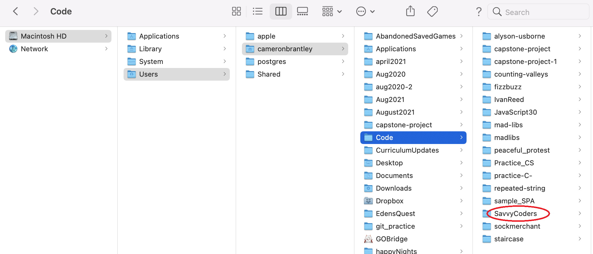
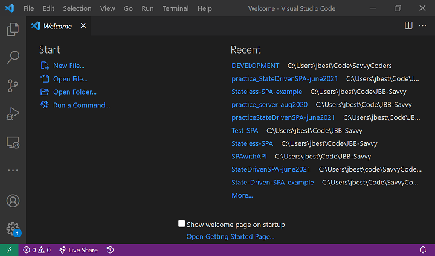
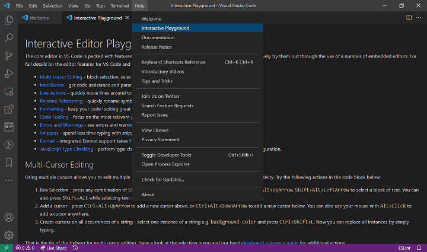

# Essential Tools for Development: CLI, VS Code, Python, PIP, and Markdown

## Welcome to the second week!

### **Objective: -**

We will become familiar with some essential tools for development, including:

- [CLI](#cli)
- [Python](#python)
- [PIP](#pip)
- [VS Code](#vs-code)
- [Markdown](#markdown)

<br>

The Command Line Interface (CLI) is the way a we will navigates through much of our computer's file structure.

It is important to become comfortable with the CLI because it enables you to easily open VS Code projects.

<br>

---

<br>

## CLI

### Interfacing with Computers

The operating system (OS) is the program (series of instructions) that runs when you turn on your computer.
It handles...

- inputs (keyboard, mouse, camera, network connections)
- outputs (monitor, speakers, network connections)
- manages shared access to computing resources and memory
- reads and writes data to the file system (FS) on behalf of any number of simultaneously running applications (web browser, code editor, terminal emulator, music player, etc).

We interact with the computer through the operating system, usually by _typing_, _touching_, or _clicking_.

Computers can receive user input through either a **Command Line Interface (CLI)** or a graphical user interface (GUI).
A computer user types commands into the CLI using the keyboard to tell the computer what to do.
The computer will display the results of the operation by writing text to the screen.
The CLI is also called the "Console", "Command Line", "Terminal", or "Shell".

**NOTE**: From here on out, we'll use the terms `terminal`, `command-line`, and `CLI` interchangeably.

<br>

**GOAL FOR THE COURSE**: Try to do most navigation by using **commands**, in our terminal, instead of clicking **pictures** with a mouse.

In other words, **LEARN TO USE YOUR KEYBOARD TO TYPE COMMANDS AND MOVE THROUGH YOUR CODE FASTER.**

<br>

### **Some Basic Terminal Commands**

- `pwd` - **P**rint **W**orking **D**irectory
- `cd` - **C**hange **D**irectory
  - `cd ~` - Move to home directory (same as just `cd`)
  - `cd ..` - Move _up_ one directory
  - `cd folderName` - Move _down into_ folder
- `ls` - List files in current/working directory
  - `ls -a` - list _all_ files (including hidden files); the `-a` is a **_flag_** that indicates the specific way we want to run the command
- `mkdir folderName` - **M**a**k**e **Dir**ectory (Create _Folder_)
- `touch fileName` - Create new _File_
- `cat fileName` - Preview file contents directly in terminal
- `history` - Print log of all previous commands

<br >

> **TIP**: Take advantage of 'auto-completion.' Type the first few characters of a file or directory name then press 'Tab.' The _command prompt_ will try to complete the name or give you a list of possible choices.</span>

<br >

> **TIP**: Press 'Up Arrow' to bring up previously typed commands.</span>

<br>

---

<br>

#### **CLI Activity 1 (Everyone)**

#### Use basic shell commands to set up your Savvy Coders directory

We will start by using the CLI to navigate through the file system on our computers.
Think of the directory structure as a 'tree' with 'branches', rather than a bunch of 1s and 0s stored in memory.
The OS abstracts all of that memory management away, so we can work directly with the human-facing interface we call a file structure.

1. Open the Git Bash CLI application on your computer.
1. Verify that you are in your `$HOME` directory. You should see a "`~`" (tilde) in your command prompt somewhere. If you don't see that, type "`cd ~`" and press 'Enter' to make sure that you are `$HOME`. You should see something like this...

   ```shell
      MINGW64 ~
   ```

1. Print your starting location: `pwd`
1. _List_ the folder contents: `ls`
1. In your `$HOME` directory (`~`), _create a folder_ called `Code` for all of your future coding projects: `mkdir Code`
1. _List_ the folder contents again (`ls`). Do you see your new folder?
1. _Move_ into your Code directory: `cd Code`
1. Inside of `Code`, _create a `SavvyCoders` directory_ for all of your Savvy-related work: `mkdir SavvyCoders`
1. _Move_ to your `$HOME` directory: `cd ~`
1. _Move_ back into your `SavvyCoders` directory: `cd Code/SavvyCoders`

The result of this activity should produce a directory structure that looks more-or-less something like this...

**For Windows Users...**


**For MacOS Users...**


<br>

---

<br>

#### **CLI Activity 2 (Students)**

#### Practice basic shell commands

1. Inside your `SavvyCoders` directory, create a new folder called `TerminalPractice`
1. _Move_ into the `TerminalPractice` directory
1. Practice using `pwd`, `cd`, `ls`, `mkdir`, and `touch` inside of the `TerminalPractice` directory
   - view your current directory name with `pwd`
   - create new .txt files with `touch`
   - create new folders with `mkdir`
   - move into and out of folders with `cd` and `cd ..`
   - view the contents of a folder with `ls`
1. Check your directory before running each command. \*\*In this exercise, your working/current directory should ALWAYS start with `~/Code/SavvyCoders/TerminalPractice`
   - If you find yourself outside of the `Code` directory, **STOP** and `cd` back to home, then cd into `TerminalPractice`
1. Open the `TerminalPractice` folder through the **_GUI_** and examine the new files and folders you created. Is everything where you expected it to be?
1. After examining the directory, delete the `TerminalPractice` folder.
1. Use these commands:
   - Delete a File -- `rm file.txt`
   - Delete a Directory -- `rm -r Directory_Name` (the -r parameter means recursively it's necessary to tell Bash that it needs to recurse (or repeat) the command through a list of all files and sub-directory within the parent directory.)

<br>

> ### For more in depth review of these commands, refer to [this document](Resources/TranslatingTerms.md) in the 'Resources' section of your curriculum.

<br>

---

<br>

## Python and PIP

If we have not yet done so, we need to install Python.

Refer to Section00 -- [Local Dev Environment and First Steps](../Section00/0.1-Local-dev-environment.md) for detailed instructions to do this.

In the section on installing Python are notes to install PIP -- the Python Package Manager

<br>

---

<br>

### **PIP Activity 1 (Everyone)**

#### Install dependencies

1. From the CLI, **install** necessary dependencies like... `Jupyter Notebook`, `NumPy`, `Matplotlib`, and `Pandas`.

   - pip install jupyter notebook
   - pip install numpy
   - pip install matplotlib
   - pip install pandas

<br>

---

<br>

## VS Code

### A Plain Text Editor for Developers

The text editor that we'll be using for this course is called [Visual Studio Code](https://code.visualstudio.com/) (_not_ Visual Studio, which is only available for Windows).

VS Code is a modular editor built for web development, maintained by Microsoft, and contributed to by a large Open Source community.

Click the link above or visit [https://code.visualstudio.com/Download](https://code.visualstudio.com/Download) to download and install it.

**Steps to install VS Code:**

- Download and start the install file
- Agree to the license terms
- Select Additional Tasks to set environmental variables
- Review selections and click install
- When done installing, launch VS Code

<br>

Once VS Code starts up, you should see an interface that looks like this: -



<br>

A great place to start learning about VS Code is by clicking `HELP` on the top toolbar. Here are links to all sorts of helps and documentations explaining how to use VS Code.

Working through the `Interactive Playground` section is a great way to get started with VS Code.



<br>

**This video on [Getting started with Visual Studio Code](https://code.visualstudio.com/docs/introvideos/basics) will clearly demonstrate basic functions of the VS Code IDE.**

To learn more about VS Code, first work through this article for a full overview of the the [VS Code User Interface](https://code.visualstudio.com/docs/getstarted/userinterface).

To maximize your success at using VS Code, here are a couple of key articles: -

- [Visual Studio Code Tips and Tricks](https://code.visualstudio.com/docs/getstarted/tips-and-tricks)
- [Guide to VS Code Shortcuts (Windows)](https://code.visualstudio.com/shortcuts/keyboard-shortcuts-windows.pdf)

- [Guide to VS Code Shortcuts (Mac)](https://code.visualstudio.com/shortcuts/keyboard-shortcuts-macos.pdf)

- [Guide to VS Code Shortcuts (Linux)](https://code.visualstudio.com/shortcuts/keyboard-shortcuts-linux.pdf)

<br>

### **SPECIAL NOTE FOR macOS users: -**

> If you're on macOS, you will need to install shell commands from the command palette in VS Code.
>
> To open the command pallet use `CMD + SHIFT + P`, then search by typing `shell command` to find the Shell Command: `Install 'code' command in PATH`.
> Select this option, and restart the terminal for the new `$PATH value` to take effect.
>
> You'll be able to type 'code .' in any folder to start editing files in that folder
>
> For expansive detailed step-by-step instructions on how to do this, read the article [Visual Studio Code on macOS](https://code.visualstudio.com/docs/setup/mac).

<br>

---

<br>

#### **VS Code Activity 1 (Everyone)**

#### How to open VS Code from the terminal

After you have successfully installed VS Code on your machine, do the following:-

1. Open your terminal and _move_ to your `SavvyCoders` directory
1. Type `code .` in the CLI and press 'Enter'

   > **NOTE**: `code .` launches VS Code (`code`) from the present directory (`.`)
1. Once VS Code has been opened, you might be prompted to install updates, go ahead and install these updates.

<br>

---

<br>

#### **VS Code Activity 2 (Students)**

#### Create and edit a new file in VS Code

1. In VS Code, use the shortcut `"Ctrl + n"` to create a new file
1. Use the shortcut `"Ctrl + s"` to save the new file and give it a name: `practice.txt`
1. Add some text to `practice.txt` and save the file.
1. In your terminal, _list_ the contents of `SavvyCoders`. Do you see `practice.txt`?
1. Preview the contents of the file in the terminal. Do you remember which shell command to use?

<br>

---

<br>

## **Markdown** -- A Simple Markup Language

[MarkDown](https://www.markdownguide.org/) is a simple markup language for formatting text. We will use `MarkDown` to write our `README.MD` file for our GitHub Repo.

You can think of `MarkDown` a bit like 'MS Word' - except rather than clicking things in a GUI, we use some coded notations to specify the intended layout and style of their text.

This file you are looking at, 2.1-EssentialDevTools.md, was written with Markdown.

>**Note that all Markdown files have an extension of .md**

<br>

### Basic Markdown formatting commands and results follow below ...

<br>

# # This is a top-level header

## ## This is a smaller 2nd-level header

### ### This is an even smaller header

...

###### ###### This is a 6th-level header, and quite small

<br>

Here is some normal text. A paragraph, even!

\_ _This text is in italics._ \_

\*\* **This text is in bold.** \*\*

\*\*\_ **_This text is in both._** \_\*\*

\~\~ ~~This text is rendered with strikethrough.~~ \~\~

E.G: Sometimes you want to embed some _stylized text_
right into **your paragraph.** Pretty cool, right!

<br>

Use dashes for unordered lists...

- Item
- Item
- Another item

Use numbers for ordered lists (in most situations, by default, one can just number all items in a list with a '1' and the numbering will auto increment) ...

1. Item one
1. Item two
1. Item three

One can create lists with sub-lists inside of lists...

1. Item one
2. Item two
3. Item three
   1. Sub-item
      - 1st sub-sub-item
      - Nest sub-sub-item
   2. Sub-item
4. Item four

### In Markdown this "---" draws a horizontal line across the page like this...

<br>

---

<br>

[I'm a formatted link to a web page!](http://www.google.com) (Look at the underlying code to see how this is structured)

To use automatic links, just drop them into your Markdown as they appear, just like this --
https://www.somepage.com

Below is an image that has been embedded (Look at the underlying code to see how this is structured)


<br>

Learn more about basic Markdown Syntax at the [Markdown website](https://www.markdownguide.org/basic-syntax/)

And here is an in-depth Markdown [Beginner’s Guide](https://itsfoss.com/markdown-guide/)

<br >

---

<br >

#### **Markdown Activity 1 (Students)**

#### Practice Basic Markdown Formatting

1. In VS Code, use the shortcut `"Ctrl + n"` to create a new file
1. Use the shortcut `"Ctrl + s"` to save the new file and give it a name: `practice.md`.
1. Now practice markdown formatting by using every notation listed above
   > **TIP**: Use `"Ctrl + Shift + V"` in VS Code to open a preview of your Markdown

<br >

---

<br >

### **Summary: -**

Congrats! You now know the basics of CLI, VS Code, npm, AND you learned your first computer “language” - Markdown!

> Remember to work at using YOUR KEYBOARD to type commands to navigate!
