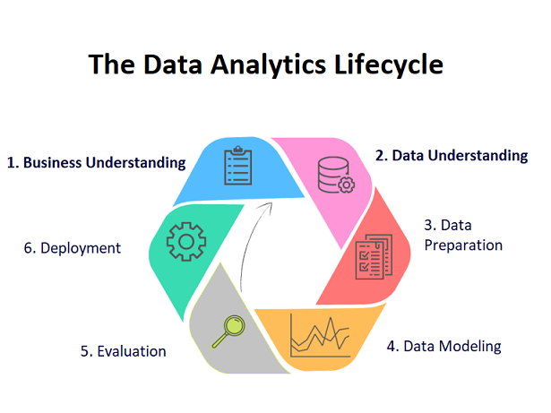

# Introduction to DAP

## Objectives of this section:-

- Why DAP
- Who are data Analysts
- The Data Science Life Cycle (DSLC)
- Crisp-DM
- Data Wrangling
- Our Capstone Project

 

 

---

 

## Data Analytics and Python skills are HOT right now!

Because of the phenomenal growth in data gathering and data interrogation, companies are looking for people who can maintain their data and analyze it.

> **Definition**: - The role of a Data Analyst is to extract and catalogue data, ...
>
> - so that organizations can pinpoint and evaluate relationships, patterns and trends ...
> - to glean insights and draw conclusions based on the data, and ...
> - then use these to make informed decisions.

 

## Why Data Analysis?

1. Data analytics is important to understand trends and patterns from the massive amounts of data that are being collected.

1. Data analytics enables organizations to uncover patterns and extract valuable insights from raw data.

1. Analytics provides insights to help optimize business performance, forecast future results, understand trends, and reduce costs.

1. Analytics helps companies understand their customers better, produce relevant content, strategize ad campaigns, develop meaningful products, and ultimately boost business performance.

 

### **The four main groups / categories of data analysis are**:-

- **Descriptive Analysis** -- the process of using current and historical data to identify trends and relationships; Often called the simplest form of data analysis because it describes trends and relationships but doesn't dig deeper.

- **Diagnostic Analysis** -- a form of advanced analytics that examines data or content to answer the question, “Why did it happen?” It is characterized by techniques such as drill-down, data discovery, data mining and correlations.

- **Predictive Analysis** -- a branch of advanced analytics that makes predictions about future outcomes using historical data combined with statistical modeling, data mining techniques and machine learning. Companies employ predictive analytics to find patterns in data to identify risks and opportunities.

- **Prescriptive Analysis** -- the process of using data to determine an optimal course of action. By considering all relevant factors, this type of analysis yields recommendations for next steps, answering the question "What should we do?" Because of this, prescriptive analytics is a valuable tool for data-driven decision-making.

 

### **The 5 V’s of Data Analytics**

Data is often described by the five V’s of Data Analytics: -

1. **Volume:** The size of data that is managed and analyze
1. **Value:** Value comes from comprehending data and pattern recognition that direct to more compelling operations
1. **Variety:** The diversity and range of various data types
1. **Velocity:** The speed at which businesses obtain, store and organize data
1. **Veracity:** The accuracy of data and data assets, which defines executive-level confidence

 

### Data Analytics has become imperative in fields like

- Transportation, Logistics, and Delivery (Supply Chain Management)
- Manufacturing, and Manufacturing processes
- Web Search Optimization (SEO), and Digital Marketing / Advertisement
- Insurance and Assessment
- Fraud and Risk Detection
- Security and Safety Industry
- Military
- Education
- Healthcare
- Banking and Finance
- Energy Industry
- Utility, and Services provisioning
- Travel and Tourism
- Communication and Media (Nielsen ratings)
- Sports, and Entertainment Industries

 

## Who are data Analysts?

The average Data Analyst is likely a natural problem-solver: Perceptive, analytical, and detail-oriented. 

The average Data Analyst tends to be confident and insightful, enjoying deep discussion to understand a particular issue.

While data analysts should have a foundational knowledge of statistics and mathematics, much of their work can be done without complex mathematics.

“Data analysis" work varies depending on the type of data that you're working with like sales, social media, inventory, demographics, etc.

 

### **Some Job titles / roles for Analysts**:-

- Business Intelligence Analyst
- Data Analyst / Scientist / Engineer
- Quantitative Analyst
- Data Analytics Consultant
- Operations Analyst
- Marketing Analyst
- Database analyst

 

### **Skills used in Data Analysis**

Skills used in the field of data Analytics include topics like R, Python, Database Management, SQL, Excel, Data Wrangling, Data Visualization, BI, Tableau, Statistical Analysis, Machine Learning, AI, etc.

 

---

 

## What Is The Data Analytics Lifecycle?

Data undergoes various stages throughout its life, during its creation, testing, processing, consumption, and reuse.

The Data Analytics Lifecycle maps out these stages for professionals working on data analytics projects.

These phases are often arranged in a circular structure that forms a Data Analytics Life-circle / cycle.

The Lifecycle is an iterative, step-by-step model for arranging the actions and events involved in gathering, processing, analyzing, and reusing data.

 

 

1. Business Understanding  -- What does the business need?

1. Data Understanding -- What data do we have / need? Is it clean?

1. Data preparation -- How do we organize the data for modeling?

1. Modeling -- What modeling techniques should we apply?

1. Evaluation -- Which model best meets the business objectives?

1. Deployment -- How do stakeholders access the results?

 

### What is Crisp-DM?

**Crisp-DM** stands for the "CRoss Industry Standard Process for Data Mining"

It is process model with six phases that naturally describes the data science life cycle.

 

 

The CRoss Industry Standard Process for Data Mining (CRISP-DM) is a model that serves as the base for a data science process.

Published in 1999 to standardize data mining processes across industries, it is the most common methodology for data mining, analytics, and data science projects.

Data science teams that combine a loose implementation of CRISP-DM with overarching team-based **Agile project management** approaches will likely see the best results.

Read all about the CRISP-DM model here in this article [What is CRISP DM?](https://www.datascience-pm.com/crisp-dm-2/)

 

---
 

## Why Python

Python has become a staple in data science, allowing data analysts and other professionals to use the language to conduct complex statistical calculations, create data visualizations, build machine learning algorithms, manipulate and analyze data, and complete other data-related tasks.

Python is a highly versatile, general-purpose, object-oriented programming language that can be used for small and complex tasks such as: back end development, software development, data science, and writing system scripts (automation) across many different industries.

Python developers are in high demand because the language is so popular and widely used as a solution in many different areas of data science and machine learning.

Note however, to become a good analyst it's not enough to just learn the Python language itself; You'll need to learn about the core Python libraries, and maybe also a Python Framework.

Further more as an Analyst, you'll need to master Versioning management using something like Git, gain a basic understanding of front-end technologies (HTML5, CSS3, JavaScript), and develop excellent communication skills.

 

### Python Learning Materials

- Python For Everyone -- PY4E
- This program was created by Dr. Charles Severance (a.k.a. Dr. Chuck)
- He’s a Clinical Professor at the University of Michigan School of Information Technology
- https://www.py4e.com/

 

---

 

## Data Wrangling

The process of cleaning and unifying messy and complex data sets for easy access and analysis.

Data professionals spend as much as 80% of their time in data wrangling -- organizing and processing data.

 

### Examples of Data Wrangling

- Joining together multiple data sets into one
- Finding gaps in data and filling/deleting them
- Getting rid of data that is unnecessary
- Identifying extreme outliers and either explaining them or getting rid of them

 

### Goals of Efficient Data Wrangling

- Show "deeper intelligence" by gathering data from several different sources
- Provide accurate, actionable data to clients, on time
- Reduces time spent collecting and organizing raw data
- Allow data scientists and analysts to focus on the analysis
- Provide intelligence for better decision-making by leaders

 

### Six Data Wrangling Steps

 

 

#### **Step #1 – Discovery**

- Find data that addresses your question
- Become familiar with your data so that you know how you will end up using it
- Identify trends, patterns and some data cells / sections that might cause issues in analysis.

#### **Step #2 – Structuring**

- Take your raw data and transform it to what you can work with
- Unstructured data is often text-heavy and contains things such as Dates, Numbers, ID codes, etc.
- Example: - When using info scrapped from a website, you might parse HTML code, pull out what you need, and discard the rest.

#### **Step #3 – Cleaning**

- Removes outliers that can potentially skew your results when analyzing the data
- Changes any null values and standardizes the data format to improve quality and consistency 
- Identifies duplicate values, standardizes systems of measurements, fixes structural errors and typos, and validates the data to make it easier to handle

#### **Step #4 – Enriching**

- Deciding if you need to add to the data by combining raw data with additional data from other sources.
- Example: - Combining two or more databases of customer information to fill in gaps in the data
- Enriching the data is an optional step that you only need to take if your current data doesn’t meet your requirements.

#### **Step #5 – Validating**

- Making sure that the data that you have is of the quality necessary to complete your project.
- The rules of data validation require repetitive programming processes that help to verify the – Quality, Consistency, Accuracy, Security, and Authenticity of data

#### **Step #6 – Publishing**

- Creating your analysis and presenting it to the public.
- You can deposit the data into a new architecture or database.
- We will display our data story using Tableau.

 

### Data Wrangling vs. Data Cleaning:

What’s the Difference between Data Wrangling and Data Cleaning?

**DATA WRANGLING** changes the data’s format by making the raw data into something more useable, and preparing the data’s structure for modeling

**DATA CLEANING** removes data that will not help in analysis because it contains errors or misinformation. It enhances the data’s accuracy, integrity, and quality..

 

---

 

## The Outcomes of this DAP Bootcamp: - Your Capstone Project

You will get to showcase what we have covered and what you have learned in the past 12-week period.

### Requirements for your Capstone:-

- 15 – 20 minutes in length
- You need to come up with a topic
- Create a question with that topic
- Create a question with that topic
- Clean and analyze data to get an answer
- Create and present your story

 

