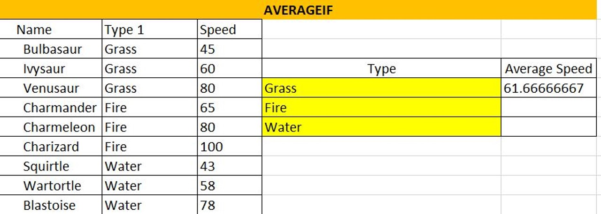

# Excel & Data Analytics

## 
Remember Data Wrangling?

The process of cleaning and unifying messy and complex data sets for easy access and analysis.

# 
&#8681;

Organizing and processing data

### Data Wrangling

  - **Step #1** – Discovery
  - **Step #2** – Structuring
  - **Step #3** – Cleaning
  - **Step #4** – Enriching
  - **Step #5** – Validating
  - **Step #6** – Publishing

 

---

## Excel
---
### What is Excel?

A program by Microsoft that is used for recording, analyzing and visualizing data in the form of a spreadsheet.

### Why Excel?
- Performs various math functions on large data sets
- You can search, sort, filter; makes it easier to clean
- Beautify data and present with charts & tables
- Reporting, accounting & analysis is easier
- Provides security through locking cells, and passwords

### Excel is HUGE

If you don’t have Excel installed, and you don’t have a Microsoft account, here is a site to signup for …
[Free Microsoft Office online | Word, Excel, Powerpoint](https://www.microsoft.com/en-za/microsoft-365/free-office-online-for-the-web)

### Lets play with Excel!

We will use the following spreadsheet together to learn more about Excel.

> **NOTE**: This spreadsheet has 3 tabs at the bottom of the screen and is wide so scroll to the right to see all the content.

### Functions

| **AND** | **AND USING IF** |
|:-------:|:----------------:|
|`=AND=AND(**[logical1], [logical2], ...**)`|`=IF(AND(**logical_test, logical_test), [“value_if_true”], [“value_if_false”]**)`|
|If a number is greater than or smaller than another number or is equal to something. | Produces whatever outcome you need it to read if you don’t want “True” or “False” … |
| Produces “True” or “False” | Like “Black” and “White” |

**Reading a function in Excel**: `=AND(B3=“Fire”,C3>70)`

### =AVERAGEIFS(C27:C38, B27:B38, F28, D27:D38,G28)

| **AVERAGEIF** | **AVERAGEIFS** |
|:-------------:|:--------------:|
|Combine averages from different cells|Calculates the average of a range based on one or more true/false conditions|
|`=AVERAGEIF(**range, criteria, [average_range]**)`|`=AVERAGEIFS(**average_range, criteria_range1, criteria1, ...**)`|

**Reading a function in Excel**: `=AVERAGEIF(B15:B23,D17,C15:C23)`

### Functions Continued

| **COUNT** | **COUNTA** |
|:-------------:|:--------------:|
|Calculates number of cells used within a range that have numbers|Calculates number of cells used within a range that have either numbers or letters|
|`=COUNT(value1:value2)`|`=COUNTA(value1:value2)`|
|
| **COUNTBLANK** | **COUNTIF** |
|Calculates number of cells used within a range that are blank|Calculates number of cells as specified. Have to use a $ for absolute values to be counted|
|`=COUNTBLANK(value1:value2)`|`=COUNTA($value$1:$value$2,criteria)`|
|
| **COUNTIFS** | 
|Counts cells in a range based on one or more true or false conditions|
|`=COUNTIFS(**criteria_range1, criteria1, [criteria_range2, criteria2], ...**)`|
|
| **IF (EQUAL TO)** |
|Returns values based on a true or false condition|
|Click on [**D105**]: `=IF(B105="Grass", "Yes", "No")`|
|
| **IF (GREATER THAN)** | **IFS** |
|Counts cells in a range based on one or more true or false conditions|Returns values based on one or more true/false conditions|
|**I105**: `=IF(H105>500, "Yes", "No")`|**D117**: `**=IFS(C117>90,"Fast", C117>50,"Normal", C117<=50,"Slow")**`|
|
| **MEDIAN** | **MODE** |
|Returns the middle value in the data|Used to find the number seen most times|
|`=MEDIAN(F117:K117)`|**D117**: `=MODE.SNGL(B129:E134)`|
|
| **OR** | **OR WITH IF** |
|Returns true/false based on two or more conditions|Let's you check multiple conditions for the if function|
|`=OR(B140="Water",C140>60)`|**D117**: `=IF(OR(H140="water",C140>60),"Yes","No")`|
|
| **STDEV.P** | **STDEV.S** |
|Calculates the Standard Deviation for the entire **population**|Calculates the Standard Deviation for a **sample**|
|`=STDEV.P(D152:D173)`|**D117**: `=STDEV.S(L152:L171)`|
|Measures how far a ‘typical’ observations is from the average of the data|
|**Ignores cells with text and logic*|
|
| **SUMIF** | **SUMIFS** |
|Calculates the sum of values in a range based on true/false conditions|Calculate the sum of a range based on one or more true/false condition|
|`=SUMIF(C177:C185,F178,D177:D185)`|**D117**: `=SUMIFS($D$189:$D$201,$C$189:$C$201,G189,$E$189:$E$201,H189)`|
|
| **VLOOKUP** | **XOR** |
|Allows searches across columns|Returns true/false based on two or more conditions|
|=VLOOKUP(G207,A205:E226,2,**1**): `=VLOOKUP(G207,A205:E226,2,1)`|**D117**: `=XOR(B231="fire",C231<60)`|
|**lookup_value**    (required) in 1st column,|
|**table_array**   (required) lookup range,|
|**col_index_num**    (required) of lookup_value,|
|**Approximate - 1/TRUE or Exact - 0/FALSE**|

 

---
# Excel Part 2 - Charts & Pivot Tables
---
### Windows Keyboard Shortcuts

|**Keyboard Shortcuts**|**Command**|
|:----------|:---------|
|CTRL + Z|Undo|
|CTRL + W|Close|
|CTRL + A|Select All|
|ALT + TAB|Switch Apps|
|ALT + F4|Close Apps|
|WIN + D|Show/Hide Desktop|
|CTRL + X|Cut|
|CTRL + C|Copy|
|CTRL + V|Paste|
|WIN + L/R Arrow|Compare Windows|
|WIN + Up/Down Arrow|
|WIN + Double Up/Down|
|ESC|
|WIN + PrtScn|Save Screenshot|
|Shift + Arrows|Hilight Text|
|CTRL + B/I/U|Customize Font|

### macOS Keyboard Shortcuts

|**Keyboard Shortcuts**|**Command**|
|:----------|:---------|
|CTRL + C|Copy|
|CTRL + X|Cut|
|CTRL = V|Paste|
|CTRL + Command + F|Fullscreen|
|Command + Mission Control|Desktop|

 

### Inserting Charts

Visually compare information inside of your data. 

Go to the Loans Tab on Excel Spreadsheet

#### Once your data is filled out...
1. Hilight the information
2. Hilight B1:C5
3. Click [**Insert**] in the ribbon
4. Bring up chart options
5. Pick the ones you want

 

### Pivot Tables

A summary of a large dataset that usually includes the total figures, average, minimum, maximum, etc.

Open Up Sales Spreadsheet

#### Once you bring up your spreadsheet...
1. Click on [**PivotTable**]
2. Dataset should already be selected
3. Select [**New Worksheet**]
4. Choose the values that you want
5. Analyze your data

#### Sales Exercise
1. Select [**Insert**]
2. Select [**PivotChart**]
3. Table/Range should be picked already
4. Select: [**CompanyName**, **ProductName**, **UnitPrice**, **Quantity** and **SubTotal**]
5. Select the [**Row Labels**] drop down, remove the "select all" tick, select [**Ana Trujiullo**], press [**Ok**]
6. Go back to [**Insert**] and choose [**PivotTable**]
7. Make sure table is selected
8. Choose [**FirstName**]
9. Choose [**CompanyName**]
10. Choose [**SubTotal**] and drag to values
11. Select [**Recommended Charts**]
