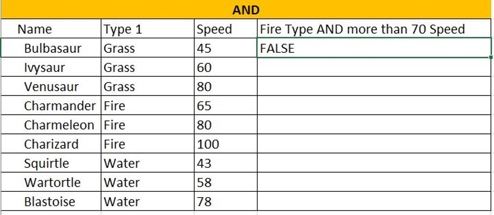
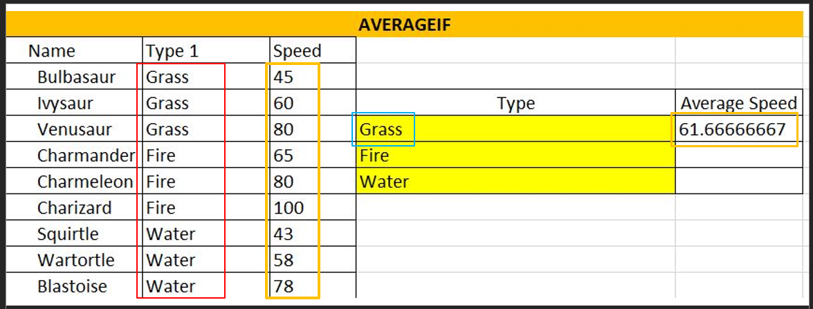

# Excel & Data Analytics

### Objectives: 
- Data Wrangling Refresher
- Understanding Excel and it's Functions
- Keyboard Shortcuts for Windows and macOS
- Pivot Table Exercise

 

## Remember Data Wrangling?

**Data Wrangling** - The process of cleaning and unifying messy and complex data sets for easy access and analysis.
- Organizing and processing data.

 

### Data Wrangling

  - **Step #1** – Discovery
  - **Step #2** – Structuring
  - **Step #3** – Cleaning
  - **Step #4** – Enriching
  - **Step #5** – Validating
  - **Step #6** – Publishing

 

---

## Excel
---
### What is Excel?

A program by Microsoft that is used for recording, analyzing and visualizing data in the form of a spreadsheet.

 
 

### Why Excel?
- Performs various math functions on large data sets
- You can search, sort, filter; makes it easier to clean
- Beautify data and present with charts & tables
- Reporting, accounting & analysis is easier
- Provides security through locking cells, and passwords

 

### Excel is HUGE

If you don’t have Excel installed, and you don’t have a Microsoft account, here is a site to signup for …
[Free Microsoft Office online | Word, Excel, Powerpoint](https://www.microsoft.com/en-za/microsoft-365/free-office-online-for-the-web)

 

### Lets play with Excel!

We will use the following spreadsheet together to learn more about Excel.

[Excel_Practice_Student.xlsx](./activities/Excel_Practice_Student.xlsx)

> **NOTE**: This spreadsheet has 3 tabs at the bottom of the screen and is wide so scroll to the right to see all the content.

 

### Functions

 

**AND**  
- `=AND([logical1], [logical2], ...)`
- If a number is greater than or smaller than another number or is equal to something.
- Produces “True” or “False”

 

**AND USING IF** 
- `=IF(AND(logical_test, logical_test), [“value_if_true”], [“value_if_false”])`
- Produces whatever outcome you need it to read if you don’t want “True” or “False” …
- Like “Black” and “White”

 

**Reading a function in Excel**: `=AND(B3=“Fire”,C3>70)`

 

**AVERAGEIF**  
- Combine averages from different cells
- `=AVERAGEIF(range, criteria, [average_range])`

**Reading a function in Excel**: `=AVERAGEIF(B15:B23,D17,C15:C23)`

 

**AVERAGEIFS**
- Calculates the average of a range based on one or more true/false conditions
- `=AVERAGEIFS(average_range, criteria_range1, criteria1, ...)`
- `=AVERAGEIFS(C27:C38, B27:B38, F28, D27:D38,G28)`

 

 

### Functions Continued

 

**COUNT** 
- Calculates number of cells used within a range that have numbers
- `=COUNT(value1:value2)`

 

**COUNTA**
- Calculates number of cells used within a range that have either numbers or letters
- `=COUNTA(value1:value2)`

 

**COUNTBLANK** 
- Calculates number of cells used within a range that are blank
- `=COUNTBLANK(value1:value2)`

 

**COUNTIF**
- Calculates number of cells as specified 
- Have to use a $ for absolute values to be counted
- `=COUNTA($value$1:$value$2,criteria)`

 

**COUNTIFS**
- Counts cells in a range based on one or more true or false conditions
- `=COUNTIFS(criteria_range1, criteria1, [criteria_range2, criteria2], ...)`

 

**IF (EQUAL TO)**
- Returns values based on a true or false condition
- Click on [**D105**]: `=IF(B105="Grass", "Yes", "No")`

 

**IF (GREATER THAN)**   
- Counts cells in a range based on one or more true or false conditions
- **I105**: `=IF(H105>500, "Yes", "No")`

 

**IFS**
- Returns values based on one or more true/false conditions
- **D117**: **`=IFS(C117>90,"Fast", C117>50,"Normal", C117<=50,"Slow")`**

 

**MEDIAN**  
- Returns the middle value in the data
- `=MEDIAN(F117:K117)`

 

**MODE**
- Used to find the number seen most times
- `=MODE.SNGL(B129:E134)`

 

**OR**  
- Returns true/false based on two or more conditions
`=OR(B140="Water",C140>60)`

 

**OR WITH IF**
- Let's you check multiple conditions for the if function
- `=IF(OR(H140="water",C140>60),"Yes","No")`

 

**STDEV.P**
- Calculates the Standard Deviation for the entire **population**
- `=STDEV.P(D152:D173)`
- Measures how far a ‘typical’ observations is from the average of the data
- **NOTE:** *Ignores cells with text and logic*

 

**STDEV.S**
- Calculates the Standard Deviation for a **sample**
- `=STDEV.S(L152:L171)`

 

**SUMIF**
- Calculates the sum of values in a range based on true/false conditions
- `=SUMIF(C177:C185,F178,D177:D185)`

 

**SUMIFS**
- Calculate the sum of a range based on one or more true/false condition
- `=SUMIFS($D$189:$D$201,$C$189:$C$201,G189,$E$189:$E$201,H189)`

 

**VLOOKUP** 
- Allows searches across columns
- =VLOOKUP(G207,A205:E226,2,**1**): `=VLOOKUP(G207,A205:E226,2,1)`
  - **lookup_value** (G207): (required) in 1st column,
  - **table_array** (A205:E226): (required) lookup range,
  - **col_index_num** (2): (required) of lookup_value,
  - **Approximate - 1/TRUE or Exact - 0/FALSE**

 

**XOR**
- Returns true/false based on two or more conditions
- `=XOR(B231="fire",C231<60)`

 

---
# Excel Part 2 - Charts & Pivot Tables
---
### Windows Keyboard Shortcuts

|**Keyboard Shortcuts**|**Command**|
|:----------|:---------|
|CTRL + Z|Undo|
|CTRL + W|Close|
|CTRL + A|Select All|
|ALT + TAB|Switch Apps|
|ALT + F4|Close Apps|
|WIN + D|Show/Hide Desktop|
|CTRL + X|Cut|
|CTRL + C|Copy|
|CTRL + V|Paste|
|WIN + L/R Arrow|Compare Windows|
|WIN + Up/Down Arrow|
|WIN + Double Up/Down|
|ESC|
|WIN + PrtScn|Save Screenshot|
|Shift + Arrows|Hilight Text|
|CTRL + B/I/U|Customize Font|

 

### macOS Keyboard Shortcuts

|**Keyboard Shortcuts**|**Command**|
|:----------|:---------|
|CTRL + C|Copy|
|CTRL + X|Cut|
|CTRL = V|Paste|
|CTRL + Command + F|Fullscreen|
|Command + Mission Control|Desktop|

 

### Inserting Charts

- Visually compare information inside of your data. 
- Go to the [**Loans**] Tab on Excel Spreadsheet

 

#### Once your data is filled out...
1. Hilight the information
2. Hilight B1:C5
3. Click [**Insert**] in the ribbon
4. Bring up chart options
5. Pick the ones you want

 

### Pivot Tables

A summary of a large dataset that usually includes the total figures, average, minimum, maximum, etc.
- Open Up [**Sales Spreadsheet**]

 

#### Once you bring up your spreadsheet...
1. Click on [**PivotTable**]
2. Dataset should already be selected
3. Select [**New Worksheet**]
4. Choose the values that you want
5. Analyze your data

 

#### Sales Exercise
1. Select [**Insert**]
2. Select [**PivotChart**]
3. Table/Range should be picked already
4. Select: [**CompanyName**, **ProductName**, **UnitPrice**, **Quantity** and **SubTotal**]
5. Select the [**Row Labels**] drop down, remove the "select all" tick, select [**Ana Trujiullo**], press [**Ok**]
6. Go back to [**Insert**] and choose [**PivotTable**]
7. Make sure table is selected
8. Choose [**FirstName**]
9. Choose [**CompanyName**]
10. Choose [**SubTotal**] and drag to values
11. Select [**Recommended Charts**]

 

### Summary: 
- **Excel** is used for recording, analyzing and visualizing data in spreadsheet form. 
- **Excel has many functions including**: 
  - AND / AND using IF
  - AVERAGEIF(S) 
  - COUNTA / COUNTBLANK / COUNTIF(S)
  - IF(S) (equal to; greater than)
  - MEDIAN / MODE
  - OR / OR using IF
  - STDEV.S and STDEV.P
  - SUMIF(S)
  - VLOOKUP
  - XOR
- Discussed some main **keyboard shortcuts** for both Windows and macOS. 
- **Pivot Tables** allow you to work with large datasets and calculate figures. 

