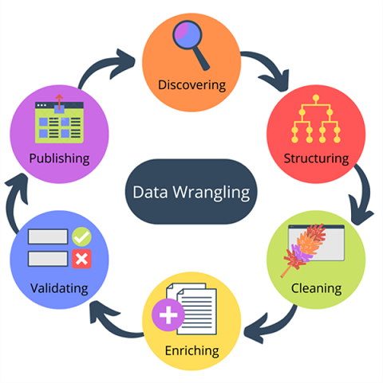
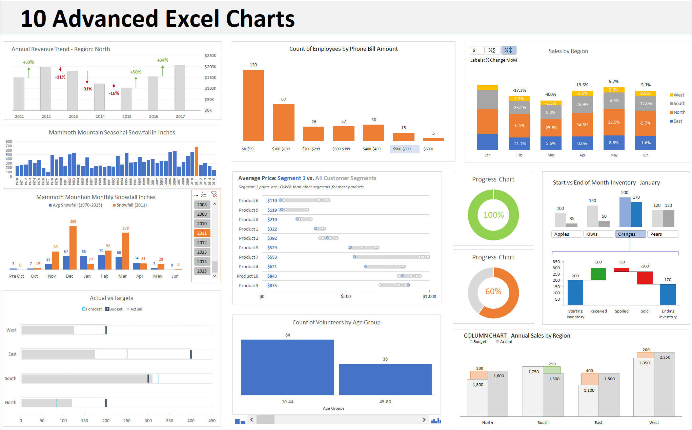

# Excel & Data Analytics

## Objectives

- Data Wrangling Refresher
- Understanding Excel and it's Functions
- Keyboard Shortcuts for Windows and macOS
- Excel Table and Chart Examples
- Excel Pivot Tables and Pivot Charts

 

## Remember Data Wrangling?

**Data Wrangling** - The process of cleaning and unifying messy and complex data sets for easy access and analysis.

- Organizing and processing data.

 

### Data Wrangling

- **Step #1** – Discovery
- **Step #2** – Structuring
- **Step #3** – Cleaning
- **Step #4** – Enriching
- **Step #5** – Validating
- **Step #6** – Publishing

 

---

## Excel

---

### What is Excel?

A program by Microsoft that is used for recording, analyzing and visualizing data in the form of a spreadsheet.

 

### Why Excel?

- Performs various math functions on large data sets
- You can search, sort, filter; makes it easier to clean
- Beautify data and present with charts & tables
- Reporting, accounting & analysis is easier
- Provides security through locking cells, and passwords

 

### Excel is HUGE

If you don’t have Excel installed, and you don’t have a Microsoft account, here is a site to signup for …
[Free Microsoft Office online | Word, Excel, Powerpoint](https://www.microsoft.com/en-za/microsoft-365/free-office-online-for-the-web)

 

Microsoft maintains very detailed help documentation on the Office suite of products.

Here is link to help you get started with using the Excel Spreadsheet Application:-

[Excel help & learning](https://support.microsoft.com/en-us/excel)

 

---

 

Using **keyboard shortcuts** help us better navigate and use the Excel interface, to be more efficient at Data Analysis.

Here is a list fof some shortcut keys to help you:-

 

### Windows Keyboard Shortcuts

|**Keyboard Shortcuts**|**Command**|
|:----------|:---------|
|CTRL + Z|Undo|
|CTRL + W|Close|
|CTRL + A|Select All|
|ALT + TAB|Switch Apps|
|ALT + F4|Close Apps|
|WIN + D|Show/Hide Desktop|
|CTRL + X|Cut|
|CTRL + C|Copy|
|CTRL + V|Paste|
|WIN + L/R Arrow|Compare Windows|
|WIN + Up/Down Arrow|
|WIN + Double Up/Down|
|ESC|
|WIN + PrtScn|Save Screenshot|
|Shift + Arrows|Hilight Text|
|CTRL + B/I/U|Customize Font|

 

### macOS Keyboard Shortcuts

|**Keyboard Shortcuts**|**Command**|
|:----------|:---------|
|CTRL + C|Copy|
|CTRL + X|Cut|
|CTRL = V|Paste|
|CTRL + Command + F|Fullscreen|
|Command + Mission Control|Desktop|

 

---

## LETS PLAY WITH EXCEL

 

### Activity #1

Open the the file [ExcelClassActivities.md](activities/ExcelClassActivities.md) in the Activities folder.

We will also use the following spreadsheet together to learn more about Excel:- `Excel_Practice_Student.xlsx`

> **NOTE**: This spreadsheet has 3 tabs at the bottom of the screen and is wide so scroll to the right to see all the content.

 

#### **Follow the Excel Class Activity 1 -- Excel Payroll Table Example**

 

---

 

## Excel Charts & Pivot Tables

In Microsoft Excel, charts are used to make a graphical representation of any set of data. A chart is a visual representation of data, in which the data is represented by symbols such as bars in a bar chart or lines in a line chart.

 

### Inserting Charts

Let us learn how to use Excel charts to visually compare information inside of our data.

 

### Activity #2

Open the the file [ExcelClassActivities.md](activities/ExcelClassActivities.md) in the Activities folder.

Go to the [**Loans**] Tab on our `Excel_Practice_Student.xlsx` for this activity.

#### **Follow the Excel Class Activity 2 -- Excel Loans Chart Example**

 

---

 

## Pivot Tables and Pivot Charts

### **Excel Pivot Table Examples**

A PivotTable is a powerful tool to calculate, summarize, and analyze data that lets you see and present summary data, comparisons, patterns, and trends in your data.

 

### Activity #3

Open the the file [ExcelClassActivities.md](activities/ExcelClassActivities.md) in the Activities folder.

We will  use the following spreadsheet to learn about Pivot tables:- `PivotTable_exercise.xlsx`

#### **Follow the Excel Class Activity 3 -- Inserting a Pivot Table – Expenses**

 

---

 

### **Excel Pivot Chart Examples**

PivotCharts complement PivotTables by adding visualizations to the summary data in a PivotTable, and allow you to easily see comparisons, patterns, and trends. Both PivotTables and PivotCharts enable you to make informed decisions about critical data in your enterprise.

 

### Activity #4

Open the the file [ExcelClassActivities.md](activities/ExcelClassActivities.md) in the Activities folder.

We will use the following spreadsheet to learn about Pivot Charts:-
  [SalesData_exercise.xlsx]

#### **Follow the Excel Class Activity 4 -- Inserting a Pivot Chart - SalesData**

 

---

 

### Summary

- **Excel** is used for recording, analyzing and visualizing data in spreadsheet form.
- Using **keyboard shortcuts** help us use Excel more efficiently
- **Pivot Tables and Pivot Charts** allow you to work with large datasets and calculate figures.
