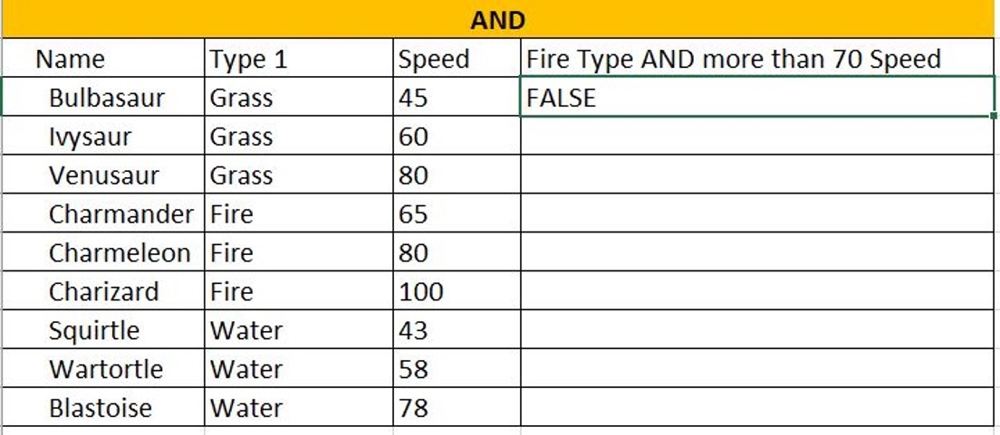
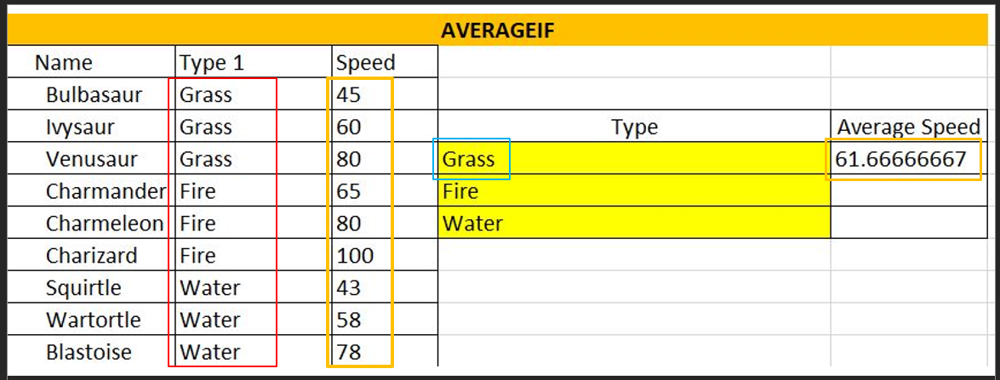

# Excel and Data Analytics

## Functions Reference

Microsoft maintains very detailed help documentation on the Office suite of products.

Here is a link to a source about Excel functions: -

<https://support.microsoft.com/en-us/office/excel-functions-by-category-5f91f4e9-7b42-46d2-9bd1-63f26a86c0eb>

Let's review a few with application to data analytics.

---

## Math Functions

---

### SUM

The **SUM** function adds values. You can add individual values, cell references or ranges or a mix of all three.

For example:

- **=SUM(A2:A10)** Adds the values in cells A2:10.

- **=SUM(A2:A10, C2:C10)** Adds the values in cells A2:10, as well as cells C2:C10.

<https://support.microsoft.com/en-us/office/sum-function-043e1c7d-7726-4e80-8f32-07b23e057f89>

---

### SUMIF

The SUMIF function allows you to aggregate data based on a selection criteria:

For example:

- =SUMIF(B29:B37,E30,C29:C37)

---

### SUMIFS

The SUMIF function allows you to aggregate data based on multiple selection criteria:

For example:

- =SUMIFS($C$42:$C$54,$B$42:$B$54,E45,$D$42:$D$54,F45)

---

## Logical Functions

---

### IF

The IF function is one of the most popular functions in Excel, and it allows you to make logical comparisons between a value and what you expect.

So an IF statement can have two results. The first result is if your comparison is True, the second if your comparison is False.

For example, =IF(C2=”Yes”,1,2) says IF(C2 = Yes, then return a 1, otherwise return a 2).

---

### AND

- =AND([logical1], [logical2], ...)
- If a number is greater than or smaller than another number or is equal to something.
- Produces “True” or “False”

---

### AND USING IF

- =IF(logical_test, [value_if_true], [value_if_false])
- Produces whatever outcome you need it to display if you don’t want “True” or “False”

---

### Or

- **OR**(logical1, [logical2], ...)
- The **OR** function returns TRUE if any of its arguments evaluate to TRUE, and returns FALSE if all of its arguments evaluate to FALSE.

---

### IFS

---

### XOR

---

## Statistical

---

### AVERAGEIF

---

### AVERAGEIFS

---

### COUNT

---

### COUNTA

---

### COUNTBLANK

---

### COUNTIF

---

### COUNTIFS

---

### MEDIAN

---

### MODE

---

### STDEV.P

---

### STDEV.S

---

## REFERENCE

---

### VLOOKUP

### Functions

 

**AND**

- `=AND([logical1], [logical2], ...)`
- If a number is greater than or smaller than another number or is equal to something.
- Produces “True” or “False”

 

**AND USING IF**

- `=IF(AND(logical_test, logical_test), [“value_if_true”], [“value_if_false”])`
- Produces whatever outcome you need it to read if you don’t want “True” or “False” …
- Like “Black” and “White”

 

**Reading a function in Excel**: `=AND(B3=“Fire”,C3>70)`

 

**AVERAGEIF**  

- Combine averages from different cells
- `=AVERAGEIF(range, criteria, [average_range])`

**Reading a function in Excel**: `=AVERAGEIF(B15:B23,D17,C15:C23)`

 

**AVERAGEIFS**

- Calculates the average of a range based on one or more true/false conditions
- `=AVERAGEIFS(average_range, criteria_range1, criteria1, ...)`
- `=AVERAGEIFS(C27:C38, B27:B38, F28, D27:D38,G28)`

 

 

### Functions Continued

 

**COUNT**

- Calculates number of cells used within a range that have numbers
- `=COUNT(value1:value2)`

 

**COUNTA**

- Calculates number of cells used within a range that have either numbers or letters
- `=COUNTA(value1:value2)`

 

**COUNTBLANK**

- Calculates number of cells used within a range that are blank
- `=COUNTBLANK(value1:value2)`

 

**COUNTIF**

- Calculates number of cells as specified
- Have to use a $ for absolute values to be counted
- `=COUNTA($value$1:$value$2,criteria)`

 

**COUNTIFS**

- Counts cells in a range based on one or more true or false conditions
- `=COUNTIFS(criteria_range1, criteria1, [criteria_range2, criteria2], ...)`

 

**IF (EQUAL TO)**

- Returns values based on a true or false condition
- Click on [**D105**]: `=IF(B105="Grass", "Yes", "No")`

 

**IF (GREATER THAN)**

- Counts cells in a range based on one or more true or false conditions
- **I105**: `=IF(H105>500, "Yes", "No")`

 

**IFS**

- Returns values based on one or more true/false conditions
- **D117**: **`=IFS(C117>90,"Fast", C117>50,"Normal", C117<=50,"Slow")`**

 

**MEDIAN**

- Returns the middle value in the data
- `=MEDIAN(F117:K117)`

 

**MODE**

- Used to find the number seen most times
- `=MODE.SNGL(B129:E134)`

 

**OR**

- Returns true/false based on two or more conditions
`=OR(B140="Water",C140>60)`

 

**OR WITH IF**

- Let's you check multiple conditions for the if function
- `=IF(OR(H140="water",C140>60),"Yes","No")`

 

**STDEV.P**

- Calculates the Standard Deviation for the entire **population**
- `=STDEV.P(D152:D173)`
- Measures how far a ‘typical’ observations is from the average of the data
- **NOTE:** *Ignores cells with text and logic*

 

**STDEV.S**

- Calculates the Standard Deviation for a **sample**
- `=STDEV.S(L152:L171)`

 

**SUMIF**

- Calculates the sum of values in a range based on true/false conditions
- `=SUMIF(C177:C185,F178,D177:D185)`

 

**SUMIFS**

- Calculate the sum of a range based on one or more true/false condition
- `=SUMIFS($D$189:$D$201,$C$189:$C$201,G189,$E$189:$E$201,H189)`

 

**VLOOKUP**

- Allows searches across columns
- =VLOOKUP(G207,A205:E226,2,**1**): `=VLOOKUP(G207,A205:E226,2,1)`
- **lookup_value** (G207): (required) in 1st column,
- **table_array** (A205:E226): (required) lookup range,
- **col_index_num** (2): (required) of lookup_value,
- **Approximate - 1/TRUE or Exact - 0/FALSE**

 

**XOR**

- Returns true/false based on two or more conditions
- `=XOR(B231="fire",C231<60)`

 

---

 

### Summary

- **Excel** is used for recording, analyzing and visualizing data in spreadsheet form.
- **Excel has many functions to help with data calculations including**:
  - AND / AND using IF
  - AVERAGEIF(S)
  - COUNTA / COUNTBLANK / COUNTIF(S)
  - IF(S) (equal to; greater than)
  - MEDIAN / MODE
  - OR / OR using IF
  - STDEV.S and STDEV.P
  - SUMIF(S)
  - VLOOKUP
  - XOR
