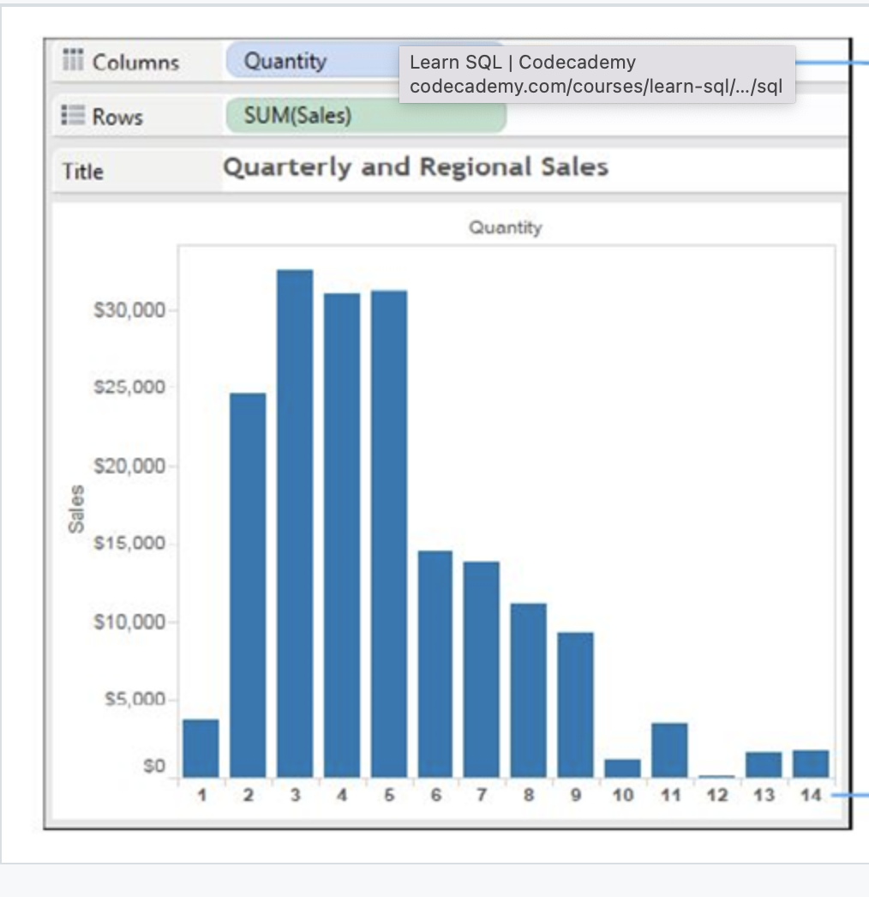
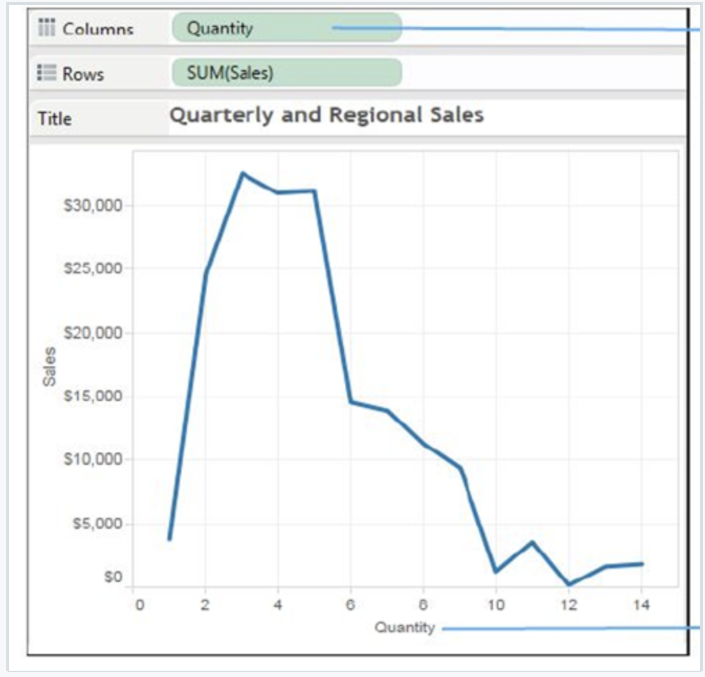
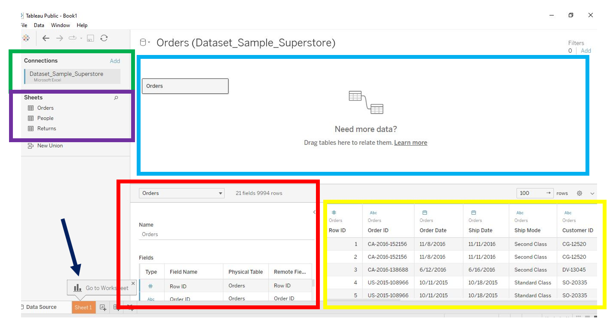
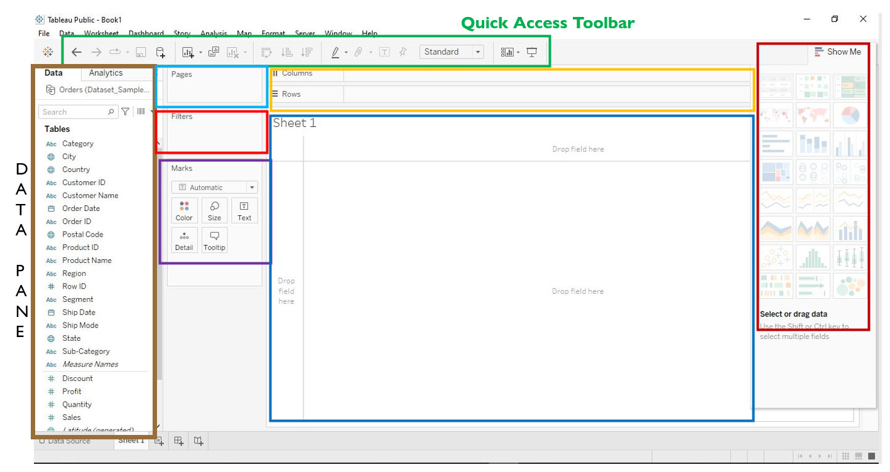

# TABLEAU

---

## DATA ANALYSIS CAN BE BORING

- Searching for/obtaining data

- Cleaning the data, you must make it “workable”

- Analyzing & finding your answers

- Trying to explain to people who don’t understand what     you’ve found

        YOU HAVE TO MAKE IT INTERESTING!
        You WANT to be able to tell your STORY!

---

## WHAT IS TABLEAU

A very powerful data visualization software that helps people view and understand data

- It makes it easier for people to explore and manage their data
- It can be a central location for data from several sources
- Changes raw data into data that is easy to understand
- It is growing really fast as a key data analytics platform
- There's a HUGE community of Tableau users
- No coding necessary

---

## POSSIBLE JOB TITLES

- Business Analyst
- BI Engineer
- Data Analyst
- BI Analyst
- BI Developer

## POSSIBLE EMPLOYERS

- Verizon
- Lenovo
- Chipotle
- REI
- Charles Schwab

 

## AS A DATA ANALYST

- You are required to manipulate the data in a tabular and systematic form to help solve some challenges that your company might be facing.

- Business analytics, the importance of data visualization and how to utilize Tableau.

## BUSINESS INTELLIGENCE

The right information to the right people at the right time to aid in better decision making.

- Business Analytics
- Data mining
- Data visualization
- Data tools
- Infrastructure

## EXAMPLES OF WHAT DATA ANALYTICS ENCOMPASSES

- Identify ways to increase profit
- Track performance
- Analyze customer behavior
- Compare data with competitors
- Discover issues or problems
- Optimize operations
- Recognize trends
- Predict range of successes

---

## DATA VISUALIZATION

- Uses pictures to represent data
- Most effective way to communicate
- LOTS of tools available
- Allows for quantitative data to be viewed easier & better decisions made quickly

---

## DATA VISUALIZATION WITH TABLEAU

- Can utilize data in various forms (except for Tableau Public)
- No technical or programming experience required
- You can data blend (connect multiple sources for one analysis using joins)
- Analyze in real-time
- Collaborate with other team members

### Advantages

- Scripting language
- Data VIsualization
- Quick Insights
- Large amounts of data
- Easy Implementation
- Responsive Dashboard

### Disadvantages

- Restrictive Imports
- Custom Formatting
- Static Parameter
- Screen Resolution
- Scheduling Reports

---

### Tableau Public

Can load from 9 different data sources

### Tableau Desktop

Can load from 77 different data sources

---

## DATA TYPES WITHIN TABLEAU

- Are automatically assigned by Tableau upon importing a new data source, but can be manually assigned as well
- Include:
  - Text Values​
  - Numerical Values
  - Date Values​
  - Date and Time Values​
  - Boolean Values
  - Geographic Values
- Can be manually assigned from the Preview Pane by clicking on the icon at the top of each column, or via the [**Fields**] pane on the left-hand side

 

---

## DATA ROLES

### Dimensions vs. Measures​

- Data in Tableau can be both text-based or numerical, and is automatically segregated into either role​
- **Dimensions:** displayed in blue in the [**Data**] pane, produce a header when added to row/column, categorical​
- **Measures:** displayed in green in the [**Data**] pane, produce an axes when added to row/column, numeric​

### Discrete vs. Continuous​ Data

- Every field is categorized as either discrete or continuous​

 

---

### Discrete Data: Notice how every quantity has a header at the bottom

 

 

### Continuous Data: Notice how quantity values are shown in a continuous axis

 

---

### OPENING TABLEAU PUBLIC

1. CONNECT PANE: where various data sources can be connected
2. OPEN PANE: where you can see recently opened files/sample dashboards
3. DISCOVER PANE: helps you connect with the Tableau Community and access videos and blogs.
        
        CLICK ON MICROSOFT EXCEL 
         >>> OPEN SAMPLE - SUPERSTORE
                CLICK/DRAG 'ORDERS' OVER TO 
                        THE WHITE AREA ON THE RIGHT

 

---

 

## Tableau's User Interface Layout

### Data Source Page

#### The Left Pane

- **Green and Purple Boxes Top Left of Data Source Image Below**
- Displays the connected data source and other details about your data
- The **purple box** is where you can 
add more connections to th data source to create cross database joins.
- The left pane does not display for cube (multidimensional) data.

#### Canvas

- **Blue Box** of Data Source Image
- Consist of two layers  
        - **Logical Layer**: The canvas opens with the logical layer, where you can create relationships between logical tables. 
        - **Physical Layer**: Double-click a table in the logical layer to go to the physical layer of the canvas, where you can add joins and unions between tables.

#### Metadata Grid

- **Red Box** of Data Source Image
- Displays the fields in your data source

#### Data grid

- **Yellow Box** of Data Source Image
- Displays first 1,000 rows of the data contained in the Tableau data source.

 

 

### Tableau Sheets 

#### Quick Access Toolbar

- **Green Box** in image below

#### Data Pane

- **Brown Box** on the left of image

#### Pages

- **Light Blue Box** center left

#### Filter

- **Bright Cherry Box** below Pages

#### Marks

- **Purple Box**

#### Shelves

- **Yellow Box**

#### Sheets

- **Dark Blue Box**

#### Show Me

- **Red Box**

 

### TABLEAU BREAKDOWN

- Each graph should require a NEW worksheet & make sure they are named properly
- Dashboards are *preps* for your STORY (aka presentation) 
- Think of each Dashboard as a “slide” where you put your STORY together. Make sure to name them properly
- Your STORY is your presentation of how you want to show your Dashboards (aka slides)

### LET'S PRACTICE

1. Plot [**SALES**] against [**CATEGORY**], SEGMENT & ORDER DATE
2. Make it a line graph
3. Filter down to Home Office for each segment
4. Delete the title above the graph
5. Convert the graph a bar graph
6. Rename the bar graph “Home Office Sales”

---

### 8 TOOLS TO PREPARE DATA FOR ANALYSIS

- JOINS
- RELATIONSHIPS
- UNIONS
- DATA BLENDING
- AGGREGATIONS
- PIVOT
- DATA INTERPRETER
- SPLIT

### JOINS

Combine data in order to filter and get rid of duplicates

- **Left Join**
- **Right Join**
- **Inner Join**
- **Full Outer Join**

1. Connect to the Super-Store dataset
2. Move [**Orders**] and click Open
3. Right-click on [**Orders**] and click Open
4. Move [**Returns**] over to the canvas
        - This creates an inner join BY DEFAULT
5. Select the correct join

Tableau will identify the primary key for joining two or more data sets together

- **Left Join:** values from LEFT Table & match to RIGHT Table
- **Right Join:** values from RIGHT Table & match to LEFT Table
- **Inner Join:** includes common data present in BOTH datasets
- **Full Outer Join:** includes ALL values from both tables

### RELATIONSHIPS

- Created when you drag more than one sheet over
- Think of it as a contract between two tables
- No joining
- Automatic & context aware
- Flexible

---

## JOINS vs RELATIONSHIPS

### UNIONS

Helps bring together data from multiple small files into one large one.

1. Connect to dataset
2. Drag over needed sheet
3. Drag over another to overlap (you'll see [**union**])
4. Overlapping icon

### Data Blending

Tableau combines related data from multiple sources in a single view

1. Connect two sources (Superstore & Global Superstore)
2. Click on [**Data table**] & [**Edit Blend Relationships**]
3. Choose [**Segment**] and "OK"
4. Drag [**Profit**] from both sets over to Columns
5. Drag [**Segment**] from Global Superstore over to Rows

### Blend

- Used to combine data from different databases that don't support joins
- Data within databases are at different levels of detail
- Joins = duplicate rows
- Involves large amount of data

### Join

Combines data in order to filter and get rid of duplicate content

- Data format is consistent across ALL sources
- Involves small amounts of data
- Data is at the same level of detail across sources

---

## Summary

In this lesson we went over possible career paths Data Analytics leads to and four tools used to prepare data in Tableau.
