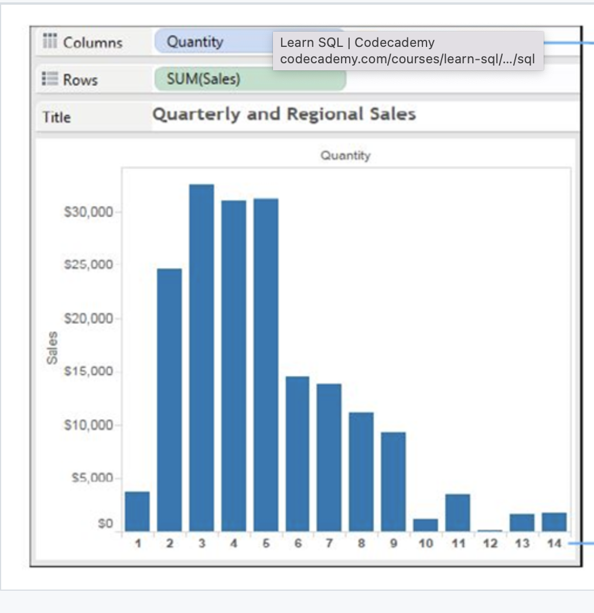

# TABLEAU (CONT.)

---

## INTRODUCTION

In this section we'll continue our study of Tableau, including an introduction to common functions within the UI, data types, filters, and common chart types.

---

## AGGREGATION

- The process of converting a set of values into a single value (ex. Sum, Average, or Median)
- Done based on Measures and Dimensions
- Aggregating Measures can be added to relational data sources
- Aggregating Dimensions can be done by [**Minimum**], [**Maximum**], [**Count**] or [**Count(Distinct)**]

 

### Let’s Try it Using the Sample Superstore Data

- Drag [**Sales**] to [**Rows**], [**Columns**], or [**Text**] (located inside the [**Marks**] pane)
- The default selected aggregation is [**SUM**]
- Right-click on [**SUM(Sales)**]
- Navigate to [**Measure(SUM)**] and select the desired aggregation from the list
- You can change the default aggregation of any measure by clicking on a measure within the [**Data**] pane (located on the far left-hand side), select [**Default Properties**] > [**Aggregations**] and then select a desired aggregation

 

## PIVOTS

- Allow you to select columns that need to be manipulated and transform them into a row for data manipulation
- MUST pivot from Columns to Rows (tall vs. wide)

### To create a pivot

- Select all desired columns in the Preview Pane
- Right-click and select [**Pivot**] from the pop-up menu

 

## The Data interpreter

- Automatically cleans and prepares data​
- Available under the [**Connections**] Pane in [**Data Source**] View whenever a unique format is detected

 

## SPLITTING COLUMNS

- The [**Split**] function is used to split a column into multiple ones​
- Example: Moving “City, State: Denver, CO” to two different cells​
- It's used to make data analysis easier​
- It offers both Automatic Split and Custom Split​
  - Automatic: Done by detecting a common separator ​
  - Custom: Allows a max of 10 new fields based on a separator in original field​

### To Split a Column

- Right-click on the desired column in the Preview Pane and select [**Split**]

 

---

## DATA TYPES WITHIN TABLEAU

- Are automatically assigned by Tableau upon importing a new data source, but can be manually assigned as well
- Include:
  - Text Values​
  - Numerical Values
  - Date Values​
  - Date and Time Values​
  - Boolean Values
  - Geographic Values
- Can be manually assigned from the Preview Pane by clicking on the icon at the top of each column, or via the [**Fields**] pane on the left-hand side

 

---

## DATA ROLES

### Dimensions vs. Measures​

- Data in Tableau can be both text-based or numerical, and is automatically segregated into either role​
- **Dimensions:** displayed in blue in the [**Data**] pane, produce a header when added to row/column, categorical​
- **Measures:** displayed in green in the [**Data**] pane, produce an axes when added to row/column, numeric​

### Discrete vs. Continuous​ Data

- Every field is categorized as either discrete or continuous​

 

Discrete Data: Notice how every quantity has a header at the bottom
 

 

Continuous Data: Notice how quantity values are shown in a continuous axis

 

---

## WORKING WITH METADATA

- Metadata from your datasets can be manipulated directly in Tableau
- Examples:
  - [**Rename**]: sheets, column names
  - [**Hide**]: columns you don’t want to use
  - [**Duplicate**]: sheets, columns

 

---

## WORKING WITH DEFAULT FIELDS

### Adding a comment to a field

- You can view a comment when you put your cursor over the field​
- Right-click on a field > select [**Default Properties**]​ > select [**Comment**]

### Changing a whole number field to a decimal (and vice versa)

- Right-click on a field, > select [**Default Properties**] > select [**Number Format**] > select [**Number**]​ > set [**Decimal Places**] to the desired value

### Changing The Fiscal Year

- Right click on a field​ > select [**Default Properties**]​ > [**Fiscal Year Start**] > select desired month from the drop-down menu

 

---

## CREATING ALIASES

- Individual data points can be given aliases in Tableau
- Right-click on any column and select [**Aliases**]
- Update the Alias name and click [**OK**]
- Second Class would be where you would rename

 

---

## FILTERING DATA

## DIMENSION FILTERS

- Allow you to filter data by dimension type
- Types of dimension filters:
  - **General:** selects one or multiple members from the domain​
  - **Wildcard:** Matches values based on the presence of a string, the same starting and ending characters, or the same set of characters.​
  - **Condition:** Matches values based on field or formula​
  - **Top:** Highlights top values by field or formula​

 

### Let’s Try it Using the Sample Superstore Data

- Connect the [**Sample_Superstore**] dataset​
- Drag the [**Orders**] sheet over to the Canvas and create a new Worksheet​
- Drag [**Sub-Category**] into [**Columns**]
- Drag [**SUM(Sales)**] into [**Rows**]
- Drag [**Sales**] to [**Text**]​ (located in the [**Marks**] pane)
- Drag [**Sub-Category**] to the [**Filters**] pane
- Create a filter​
- You can remove the filter by dragging [**Sub-Category**] outside of the [**Filters**] pane

 

---

## MEASURE FILTERS

- Allow you to filter measure data types
- Types of measure filters:
  - **Range of values:** filter to identify sales representatives within a range of sales totals​
  - **At least:** filter to identify sales reps with sales ABOVE a certain level​
  - **At most:** filter to identify sales reps with sales BELOW a certain level​
  - **Special:** filter to identify all values, null values and non-null values

 

### Let’s Try it Using the Sample Super Store Data

- Connect the [**Sample_Superstore**] dataset​
- Drag the [**Orders**] sheet over to the Canvas and create a new Worksheet​
- Drag [**Sub-Category**] into [**Rows**]
- Drag [**Sales**] into [**Label**]​ (located in the [**Marks**] pane)
- Resize for visibility​
- Sort the view in descending order​
- Drag [**Sales**] to the [**Filters**] pane
- Click [**Next**]
- Set your filter​ and click [**OK**]
- You can remove the filter by dragging Sales outside of the [**Filters**] pane

 

---

## DATE FILTERS

- Allow you to filter your data by specified date range
-Types of date filters:
  - **Relative Dates:** can specify a range of dates that are updated based on the date and time
  - **Range of Dates:** can specify a range of dates to define a fixed range of dates to filter
  - **Discrete Dates:** can specify a discrete date value in the dialog box
  - **Individual Dates:** can select individual dates to filter specific dates from the view
  - Some additional date filter options include selecting null dates, non-null dates and all dates by specifying a start/end date

 

### Let’s Try it Using the Sample Super Store Data

- Connect the [**Sample_Superstore**] dataset​
- Drag the [**Orders**] sheet over to the Canvas and create a new Worksheet​
- Drag [**Order Date**] into [**Rows**]
- Drag [**Sales**] to [**Label**] (located in the [**Marks**] Pane)
- Expand [**Order Date**] to show [**Quarter(Order Date)**] and [**Month(Order Date)**] by clicking the "+" to the left of the field name
- Restructure it by dragging [**Year(Order Date)**] to [**Columns**]
- Drag [**Order Date**] to the [**Filters**] pane
- Click on [**Range of Dates**], select a date range, and click [**OK**]

 

---

## VISUAL FILTERS

- Visual Filters are filters that are applied straight from Tables, Maps and Charts

 

### Let’s Try it Using the Sample Super Store Data

- Connect the [**Sample_Superstore**] dataset​
- Drag the [**Orders**] sheet over to the Canvas and create a new Worksheet​
- Drag [**Sub-Category**] into [**Rows**]
- Drag [**Sales**] into [**Columns**] AND [**Label**]
- Sort the view in descending order
- Select a Sub-category from the view and apply an exclusion filter by right-clicking a field and selecting [**Exclude**]

 

---

## CONTEXT FILTERS

- The ONLY filter in Tableau that is independent and used for improving the performance of reports​ and creating dependent numerical filter​s
- Any other filters created alongside a context filter are dependent on the output of the context filter​

 

### Let’s Try it Using the Sample Super Store Data

- Connect the [**Sample_Superstore**] dataset​
- Drag the [**Orders**] sheet over to the Canvas and create a new Worksheet​
- Drag [**Sub-Category**] into [**Columns**]
- Drag [**Sales**] to [**Rows**]
- Sort the view in descending order
- Add [**Sales**] to [**Label**] (Located in the [**Marks**] pane)
- Drag [**Category**] to the [**Filters**] pane
- Select [**Furniture**] from the list
- Apply the filter by clicking [**OK**]

 

---

## DATA SOURCE FILTERS

- Applied to data sources that are connected to Tableau to make the worksheet work more efficiently.​
- Changes are made across ALL worksheets​
- Data Source Filters are considered an efficient way to limit scope of data for performance/security purposes
- Extract filters are the same as data source filters, just applied to the extract connection.

 

### Let’s Try it Using the Sample Super Store Data

- Connect the [**Sample_Superstore**] dataset​
- Drag the [**Orders**] sheet over to the Canvas and create a new Worksheet​
- Add [**Regions**] into [**Rows**]
- Add [**Sales**] to [**Text**] (located in the [**Marks**] pane)
- Drag [**Region**] to [**Color**] (also located in the [**Marks**] pane)
- Drag [**Sub-Category**] to [**Rows**]
- Drag [**Sales**] into [**Columns**]
- Click on [**Data Source**] and [**Add**]
- Select [**Add**] from the box​
- Click on [**City**], click [**OK**], then click [**OK**] again​
- NOTE: The entire worksheet filter can be viewed in the top right corner​

 

---

## INTERACTIVE FILTERS

- Allows users to interact with the data via Drop-down, List, Radio Button or Checkbox​
- Can be applied to numbers, dates and string data types

 

### Let’s Try it Using the Sample Super Store Data

- Connect the [**Sample_Superstore**] dataset​
- Drag the [**Orders**] sheet over to the Canvas and create a new Worksheet​
- Drag [**Sub-Category**] into [**Columns**]
- Drag [**Sales**] into [**Rows**] and [**Label**]
- Sort the view in descending order​
- Select [**Sub-Category**] and click on [**Show Filter**]

 

---

## SORTING

- Based on data source order, field, alphabetical order or manual​
- On a measure, can be applied through a dimensional sort

 

---

## GROUPS

- Aggregate the data of dimension members​
- Example: The top 5 sales reps by total salary are in a single row​
- Once grouped, can be used inside of any filters

 

---

## SETS

- Custom fields that define a subset of data based on some conditions​
- Example: Customers with sales over a certain level​
- **CONSTANT sets:** Do not change after they are created​
- **COMPUTED sets:** Types of sets that change with the change in data​
- **COMBINED sets:** Two sets combined to compare different members​
- **BUILDING sets:** Created through manual selection, condition, ranking

 

---

## BINS

- Equal-sized containers that store data values that correspond to or fit within the bin size
- Can use any discrete field to create them​
- Created by right-clicking on a field and selecting [**Create**] > [**Bins**]

 

---

## HIERARCHIES

- An arrangement where entities are present at various levels​
- Created by adding one dimension as a level under the principal one​
- Example: Category & Sub-Category in Rows and SUM(Sales) in Text​
- Can be used as dimensions​
- Created by right-clicking a field, selecting [**Hierarchy**] > [**Create Hierarchy**], and then adding dimensions as desired

 

---

## CREATING CHARTS

- Charts are often easier to understand than tables with numbers​, and are usually more visually appealing
- Options for charts can be selected by clicking on the [**Show Me**] button on the upper right corner​ of the task bar

---

## TEXT TABLE AND CROSS TABLE

- Drag [**Sub-Category**] to [**Rows**]
- Drag [**Region**] to [**Columns**]
- Drag [**Sales**] to [**Text**] (located in the [**Marks**] pane)

 

---

## HIGHLIGHT TABLES

- Drag [**Regions**] into [**Columns**]
- Drag [**Sub-Category**] into [**Rows**]
- Drag [**SUM(Sales)**] to [**Text**]
- Change drop-down to [**Square**]
- Drag [**Sales**] to [**Colors**] (located in the [**Marks**] pane)
- Edit color by right clicking the legion on the right-hand side and selecting [**Colors**]

 

---

## HEAT MAPS

- 2-D representations of data that use color to convey info​
- As the density of records per mark increases, the color intensity increases
- Drag [**Sub-Category**] into [**Rows**]
- Drag [**Region**] into [**Columns**]
- Drag [**SUM(SALES)**] to [**Color**] (located in the [**Marks**] pane)

 

---

## STACKED BAR CHART

- Used to highlight one measure against several other values​
- Each category is divided into subcategories for detailed analysis​
- Can split bar into categories
- Drag [**Sub-Category**] into [**Columns**]
- Drag [**SUM(Sales)**] into [**Rows**]
- Drag [**Region**] to [**Color**] (located in the [**Marks**] pane)

 

---

## LINE CHART

- Shows trend of data over a period of time​
- Normally used when there’s a date data type
- Drag [**Order Date**] into [**Columns**]
- Drag [**Sales**] into [**Rows**] (Marks type should change automatically to line)​
- Date can be discrete or continuous (Right-click on Order Date)

---

## SUMMARY

In this section we discussed common functions, data types, filters, and common chart types within Tableau.
